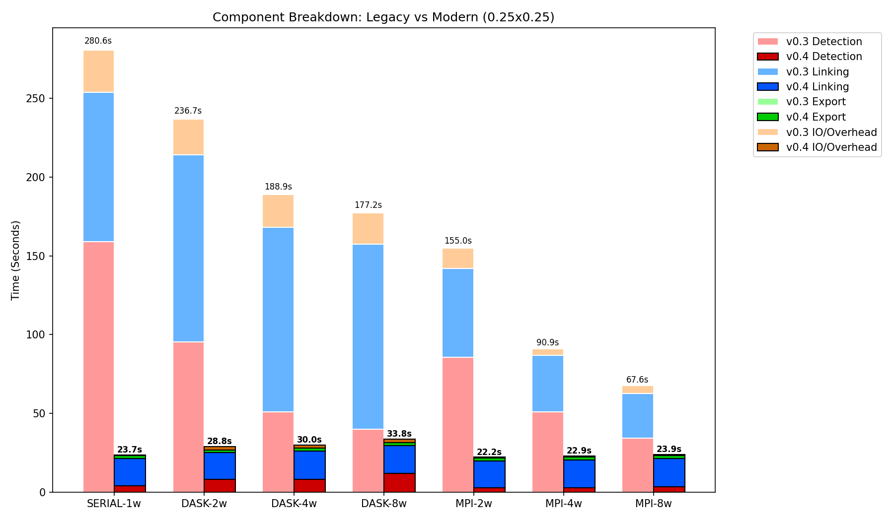

# PyStormTracker

[](https://github.com/mwyau/PyStormTracker/actions/workflows/ci.yml)
[](https://pystormtracker.readthedocs.io/en/latest/?badge=latest)
[](https://codecov.io/github/mwyau/PyStormTracker)
[](https://pypi.org/project/PyStormTracker/)


[](https://hub.docker.com/r/xddd/pystormtracker)
[](https://github.com/orgs/xddd/packages/container/package/pystormtracker)
[](https://doi.org/10.5281/zenodo.18764813)

**PyStormTracker** is a high-performance Python package for cyclone trajectory analysis. It implements the "Simple Tracker" algorithm and provides a scalable framework for processing large-scale climate datasets like ERA5.

The project is currently being expanded to include a Python port of the adaptive constraints tracking algorithm from **Hodges (1999)** and Accumulated Track Activity metrics.

Initially developed at the **National Center for Atmospheric Research (NCAR)** as part of the **2015 SIParCS** program, PyStormTracker leverages task-parallel strategies and tree reduction algorithms to efficiently process large-scale climate datasets.

## Features

- **High-Performance Architecture**: Uses an **Array-Backed** data model to eliminate Python object overhead and ensure zero-copy serialization during parallel execution. **Achieves up to 11.8x speedup in serial workloads.**
- **JIT-Optimized Kernels**: Core mathematical filters are implemented in **Numba**, running at raw C speeds while releasing the GIL for true multi-process execution.
- **Xarray Native**: Seamlessly handles NetCDF and GRIB formats with coordinate-aware processing and robust variable alias handling (e.g., `msl`/`slp`, `lon`/`longitude`).
- **Scalable Backends**: 
  - **Serial (Default)**: Standard sequential execution.
  - **Dask**: Multi-process tree-reduction for local or distributed scaling.
  - **MPI**: High-performance distributed execution via `mpi4py`.
- **Typed & Modern**: Built for **Python 3.11+** with strict type safety and `mypy` compliance.
- **Interoperable**: Full support for the standard **IMILAST** intercomparison format (`.txt`) with human-readable datetime strings.

<p align="center">
  
  <br>
  <i>Significant performance gains in v0.4.0+ compared to the legacy v0.3.3 architecture on high-resolution ERA5 data.</i>
</p>

## Technical Methodology

PyStormTracker treats meteorological fields as 2D images and leverages JIT-compiled Numba loops for high-performance feature detection:

- **Local Extrema Detection**: Employs an optimized sliding window filter to efficiently identify local minima (e.g., cyclones) or maxima (e.g., anticyclones, vorticity).
- **Intensity & Refinement**: Applies the discrete **Laplacian operator** to measure the "sharpness" of the field at each candidate center. This metric resolves duplicate detections, ensuring only the most physically intense point is retained when adjacent pixels are flagged.
- **Trajectory Linking**: Connects detected centers across consecutive time steps into continuous trajectories using a vectorized nearest-neighbor heuristic linking strategy.

## Documentation

Full documentation, including API references and advanced usage examples, is available at [pystormtracker.readthedocs.io](https://pystormtracker.readthedocs.io/).

## Installation

### Prerequisites
- Python 3.11+
- (Optional) OpenMPI for MPI support.
- **Windows Users**: the `eccodeslib` GRIB helper library is only required on Linux/macOS. (Note: GRIB/ecCodes support on Windows is currently experimental and untested).

### From PyPI (Recommended)
You can install the latest stable version of PyStormTracker directly from PyPI:

Using `pip` (standard):
```bash
pip install PyStormTracker
```

Using `uv` (recommended):
```bash
# For use as a CLI tool
uv tool install PyStormTracker

# For use as a library in your project
uv add PyStormTracker
```

### From Source
Install with `uv` (Recommended):
```bash
git clone https://github.com/mwyau/PyStormTracker.git
cd PyStormTracker
uv sync
```

## Usage

### Command Line Interface

Once installed, you can use the `stormtracker` command directly:

```bash
stormtracker -i data.nc -v msl -o my_tracks
```

#### Command Line Arguments

| Argument | Short | Description |
| :--- | :--- | :--- |
| `--input` | `-i` | **Required.** Path to the input NetCDF/GRIB file. |
| `--var` | `-v` | **Required.** Variable name to track (e.g., `msl`, `vo`). |
| `--output` | `-o` | **Required.** Path to the output track file (appends `.txt` if missing). |
| `--num` | `-n` | Number of time steps to process. |
| `--threshold` | `-t` | Detection threshold (defaults: `1e-4` for `vo`, `0.0` otherwise). |
| `--mode` | `-m` | `min` (default) for low pressure, `max` for vorticity/high pressure. |
| `--backend` | `-b` | `serial` (default), `dask`, or `mpi`. |
| `--workers` | `-w` | Number of Dask workers (defaults to CPU core count). |
| `--engine` | `-e` | Xarray engine (e.g., `h5netcdf`, `netcdf4`, `cfgrib`). |

### Python API

You can easily integrate PyStormTracker into your own scripts or Jupyter Notebooks:

```python
import pystormtracker as pst

# 1. Instantiate the tracker (defaults to Serial backend)
tracker = pst.SimpleTracker()

# 2. Run the tracking algorithm. Returns an array-backed Tracks object.
tracks = tracker.track(
    infile="data.nc", 
    varname="msl", 
    mode="min",
    start_time="2025-01-01",   # Optional: limit by start date
    end_time="2025-01-31",     # Optional: limit by end date
    backend="dask",            # Optional: use 'serial', 'dask', or 'mpi'
    n_workers=4
)

# 3. Analyze the results programmatically
for track in tracks:
    if len(track) >= 8:
        print(f"Track {track.track_id} lived for {len(track)} steps.")

# 4. Export results
tracks.write("output.txt", format="imilast")
```

## Sample Data

Sample datasets for testing and benchmarking are hosted in the [PyStormTracker-Data](https://github.com/mwyau/PyStormTracker-Data) repository.

## Development

### Setup
Using `uv` is the recommended way to set up your environment:
```bash
# Install dependencies and sync virtual environment
uv sync
```

### Quality Control
Run automated checks using `uv run`:

**Linting & Formatting:**
```bash
uv run ruff check . --fix
uv run ruff format .
```

**Type Checking:**
```bash
uv run mypy src/
```

### Tiered Testing
To keep development cycles fast, testing is tiered:
- **Fast Tests**: Default local runs (skips integration tests).
- **Integration Tests**: Integration and regression tests.
  - **Local**: Runs "short" variants (60 time steps) to ensure backend consistency quickly.
  - **CI**: Runs "full" (all time steps) variants, including legacy regressions.
- **Full Suite**: Everything.

**Run fast unit tests only (Default):**
```bash
uv run pytest
```

**Run integration tests (Short variants locally):**
```bash
uv run pytest --run-integration
```

**Run everything:**
```bash
uv run pytest --run-all
```

## Citations

If you use this software in your research, please cite the following:

- **Yau, A. M. W.**, 2026: mwyau/PyStormTracker. *Zenodo*, [https://doi.org/10.5281/zenodo.18764813](https://doi.org/10.5281/zenodo.18764813).

- **Yau, A. M. W. and Chang, E. K. M.**, 2020: Finding Storm Track Activity Metrics That Are Highly Correlated with Weather Impacts. *J. Climate*, **33**, 10169–10186, [https://doi.org/10.1175/JCLI-D-20-0393.1](https://doi.org/10.1175/JCLI-D-20-0393.1).

## References

 - **Yau, A. M. W., K. Paul and J. Dennis**, 2016: PyStormTracker: A Parallel Object-Oriented Cyclone Tracker in Python. *96th American Meteorological Society Annual Meeting*, New Orleans, LA. *Zenodo*, [https://doi.org/10.5281/zenodo.18868625](https://doi.org/10.5281/zenodo.18868625).

 - **Neu, U., et al.**, 2013: IMILAST: A Community Effort to Intercompare Extratropical Cyclone Detection and Tracking Algorithms. *Bull. Amer. Meteor. Soc.*, **94**, 529–547, [https://doi.org/10.1175/BAMS-D-11-00154.1](https://doi.org/10.1175/BAMS-D-11-00154.1).
   - **IMILAST Intercomparison Protocol**: [https://proclim.scnat.ch/en/activities/project_imilast/intercomparison](https://proclim.scnat.ch/en/activities/project_imilast/intercomparison)
   - **IMILAST Data Download**: [https://proclim.scnat.ch/en/activities/project_imilast/data_download](https://proclim.scnat.ch/en/activities/project_imilast/data_download)

- **Hodges, K. I.**, 1999: Adaptive Constraints for Feature Tracking. *Mon. Wea. Rev.*, **127**, 1362–1373, [https://doi.org/10.1175/1520-0493(1999)127<1362:ACFFT>2.0.CO;2](https://doi.org/10.1175/1520-0493(1999)127<1362:ACFFT>2.0.CO;2).

## License

This project is licensed under the BSD-3-Clause terms found in the `LICENSE` file.
