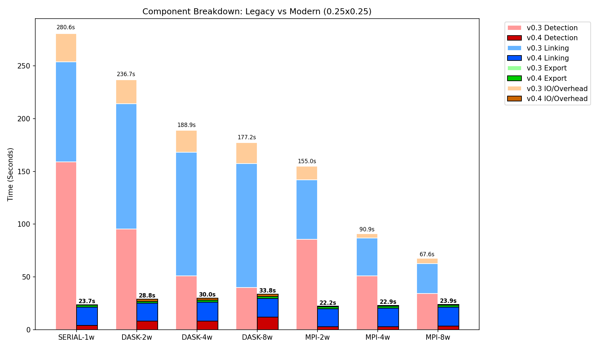

# PyStormTracker

[](https://github.com/mwyau/PyStormTracker/actions/workflows/ci.yml)
[](https://pystormtracker.readthedocs.io/en/latest/?badge=latest)
[](https://codecov.io/github/mwyau/PyStormTracker)
[](https://pypi.org/project/PyStormTracker/)
[](https://test.pypi.org/project/PyStormTracker/)
[](https://anaconda.org/channels/conda-forge/packages/pystormtracker/overview)
[](https://github.com/mwyau/PyStormTracker/blob/main/LICENSE)
[](https://pypi.org/project/PyStormTracker/)
[](https://hub.docker.com/r/xddd/pystormtracker)
[](https://github.com/orgs/xddd/packages/container/package/pystormtracker)
[](https://doi.org/10.5281/zenodo.18764813)

<p align="center"> <strong> <a href="https://pystormtracker.readthedocs.io/en/latest/interactive.html"> Storm Track Explorer </a> </strong> <br> <em>Temporarily disabled while the explorer is being redesigned.</em></p>

**PyStormTracker** is a Python package for cyclone trajectory analysis. It provides cyclone detection, trajectory construction, and track-based analysis for meteorological and climate datasets. The package includes a Numba implementation of the Simple Tracker described by **Yau and Chang (2020)** and TRACK algorithms described by **Hodges (1994, 1995, 1999)**. The project was initially developed at the **National Center for Atmospheric Research (NCAR)** during the **2015 SIParCS** program.

## Features

- **Vectorized, array-backed data model**: Stores track coordinates, times, identifiers, and variables in contiguous NumPy arrays. `Track` objects are views over this storage rather than independent collections of center objects.
- **Numba JIT-compiled kernels**: Detection, Laplacian intensity, great-circle geometry, connected-component labeling (CCL), subgrid refinement, and Modified Greedy Exchange (MGE) kernels use cached, GIL-free Numba functions.
- **Multiple Algorithms**:
  - **Simple**: Fast, local-extrema detection and deterministic nearest-neighbor linking.
  - **Hodges (TRACK)**: Thresholded object detection with connected-component labeling (CCL), spherical cost functions, adaptive constraints, and iterative Modified Greedy Exchange (MGE) linking based on TRACK. See the [Hodges implementation documentation](docs/hodges.md) and [spectral filtering accuracy](docs/spectral_accuracy.md).
  - **HEALPix**: Thresholded object detection on a one-dimensional HEALPix neighbor graph, followed by the Hodges MGE linker.
- **Coordinate-aware Xarray input**: `DataLoader` opens NetCDF, GRIB, and Zarr data, resolves common variable and coordinate aliases, and identifies regular latitude-longitude, full Gaussian, reduced-Gaussian, projected, and HEALPix grids.
- **Execution Backends**:
  - **Simple**: Serial, threaded Dask detection, and MPI detection. Parallel paths gather detections before one linking pass.
  - **Hodges and HEALPix**: Serial only; unsupported backend selections raise an error.
- **Typed Implementation**: Built for **Python 3.11+** with strict type safety and `mypy` compliance.
- **Formats and analysis**: Reads IMILAST and TrackJSON track data; writes IMILAST, TRACK tdump, and TrackJSON. Analysis functions include secondary-variable sampling, track matching, gridded cyclone and track metrics, Eulerian variance and wind indices, CORMAX, and CCA/PCA truncation cross-validation.



*Measured v0.3.3 and v0.4.0 timings for the 0.25° ERA5 benchmark described in the [benchmark documentation](docs/benchmark.md).*

## Technical Methodology

The trackers apply the following stages:

- **Preprocessing**: Optional spherical harmonic transform (SHT) filtering on global grids, discrete cosine transform (DCT) filtering on regional grids, Sardeshmukh-Hoskins spectral tapering, and regridding to polar stereographic or HEALPix coordinates. Full and reduced Gaussian grids are handled through `ducc0` geometry metadata.
- **Detection**: The Simple tracker applies a sliding-window local-extrema filter and uses the discrete Laplacian magnitude to select among adjacent extrema. Hodges and HEALPix use thresholding, connected-component labeling, object filtering, and local-extrema detection.
- **Subgrid Refinement**: Optional local quadratic surface fitting estimates a stationary point below the grid spacing. It is off by default for Simple and on by default for Hodges and HEALPix. On periodic global Hodges grids, a `RectSphereBivariateSpline` value is also evaluated at the quadratic center.
- **Linking**: Simple uses deterministic nearest-neighbor linking with a vectorized great-circle distance matrix. Hodges and HEALPix use Modified Greedy Exchange with spherical displacement and smoothness constraints.

## Documentation

Full documentation, including API references and advanced usage examples, is available at [pystormtracker.readthedocs.io](https://pystormtracker.readthedocs.io/).

## Installation

### Prerequisites

- **Python 3.11+**
- **Message Passing Interface (MPI)**:
  - **Linux/macOS**: `OpenMPI` is recommended and included as a development dependency.
  - **Windows**: Use `winget install -e --id Microsoft.msmpi` (recommended) or [MS-MPI](https://learn.microsoft.com/en-us/message-passing-interface/microsoft-mpi).
- **Spherical Harmonic Transform (SHT) engine**:
  - `ducc0` provides scalar and spin-weighted spherical harmonic transforms, reduced-grid synthesis, and HEALPix geometry.
- **Free-threaded Python**:
  - Python 3.14 free-threaded support is experimental. CI excludes `eof`, `grib`, and `zarr`: `xeofs` requires a `statsmodels` source build on 3.14t, while `eccodeslib` has no compatible free-threaded distribution for GRIB support.

### From PyPI

You can install the latest stable version of PyStormTracker directly from PyPI:

Using `pip`:

```bash
# Standard installation
pip install PyStormTracker

# With optional components
pip install "PyStormTracker[mpi]"     # Includes mpi4py for distributed execution
pip install "PyStormTracker[grib]"    # Includes GRIB support
pip install "PyStormTracker[netcdf4]" # Includes NetCDF4 backend
pip install "PyStormTracker[zarr]"    # Includes Zarr support (with remote HTTP/S3/GS)
pip install "PyStormTracker[eof]"     # Includes xeofs for CCA/PCA analysis
pip install "PyStormTracker[all]"     # Includes non-visualization optional components
```

Using `uv`:

```bash
# For use as a CLI tool
uv tool install "PyStormTracker[mpi]"

# For use as a library in your project
uv add "PyStormTracker[mpi]"
```

### From Conda-Forge

You can also install PyStormTracker from `conda-forge`:

Using `mamba`:

```bash
mamba install -c conda-forge pystormtracker
```

Using `conda`:

```bash
conda install -c conda-forge pystormtracker
```

### From Source

Install with `uv`:

```bash
git clone https://github.com/mwyau/PyStormTracker.git
cd PyStormTracker
uv sync
```

## Usage

### Command Line Interface

Once installed, the `stormtracker` command provides separate subcommands for tracking, sampling, comparison, and conversion:

#### 1. Track Features

Run the core storm tracking algorithm (e.g., tracking cyclones in MSLP):

```bash
stormtracker track -i data.nc -v msl -o tracks.trackjson -m min -a hodges -f trackjson
```

#### 2. Sample Variables

Extract external variables (e.g., precipitation) along existing tracks:

```bash
# Calculate mean precipitation within a 500km radius of storm centers
stormtracker sample -i tracks.trackjson -d precip.nc -v pr -o tracks_enriched.trackjson --method mean --radius 500
```

#### 3. Match and Intercompare

Compare tracks from different datasets or ensemble members:

```bash
# Match tracks from two sources with a 200km mean distance threshold
stormtracker compare --ref era5.trackjson --comp gfs.trackjson --max-dist 200 --json
```

#### 4. Convert & Visualize

Convert between formats; HTML output is currently a static compatibility placeholder:

```bash
# Emit the temporary static HTML placeholder
stormtracker convert -i tracks.trackjson -o explorer.html -f trackjson -F html
```

#### CLI Argument Reference

Use `stormtracker <command> --help` for detailed argument lists. Key options for the `track` command include:

| Argument                                  | Short | Description                                                                                                    |
| :---------------------------------------- | :---- | :------------------------------------------------------------------------------------------------------------- |
| `--input`                                 | `-i`  | Path to the input NetCDF/GRIB file.                                                                            |
| `--var`                                   | `-v`  | Variable name to track (e.g., `msl`, `vo`).                                                                    |
| `--output`                                | `-o`  | Path to the output track file.                                                                                 |
| `--algorithm`                             | `-a`  | `simple` (default) or `hodges`.                                                                                |
| `--format`                                | `-f`  | Output format: `auto`, `imilast`, `hodges`, or `trackjson`; recognized extensions are inferred automatically.  |
| `--mode`                                  | `-m`  | `auto` (default), `min`, or `max`; known aliases resolve automatically.                                        |
| `--backend`                               | `-b`  | `serial`, `dask`, or `mpi`. Dask and MPI tracking currently apply only to Simple.                              |
| `--workers`                               | `-w`  | Number of parallel workers.                                                                                    |
| `--lmin`, `--lmax`                        |       | Optional spectral filter bounds. Supply both to apply a filter; omit both to leave the native field unchanged. |
| `--taper-points`                          |       | Independent spatial taper width; zero disables tapering.                                                       |
| `--nside`                                 |       | Target HEALPix resolution; omitted values are derived from the source grid.                                    |
| `--subgrid-refine`, `--no-subgrid-refine` |       | Override refinement defaults. Off for simple; on for Hodges and HEALPix.                                       |

### Python API

The trackers can also be called directly:

```python
import pystormtracker as pst

tracker = pst.HodgesTracker()

tracks = tracker.track(infile="data.nc", variable_name="vo", mode="max")
```

### Analyze the results programmatically

```python
for track in tracks:
    if len(track) >= 8:
        print(f"Track {track.track_id} lived for {len(track)} steps.")
```

### Export results

```python
tracks.write("output.txt", format="imilast")
```

## Sample Data

Sample datasets for testing and benchmarking are hosted in the [PyStormTracker-Data](https://github.com/mwyau/PyStormTracker-Data) repository.

## Development

### Setup

Using `uv` to set up your development environment:

```bash
# Install dependencies and sync virtual environment
uv sync --all-extras
```

### Quality Control

Run automated checks using `uv run`:

**Linting & Formatting:**

```bash
uv run ruff check . --fix
uv run ruff format .
```

**Type Checking:**

```bash
uv run mypy
```

### Tiered Testing

To keep development cycles fast, testing is tiered:

- **Fast Tests**: Default local runs (skips integration tests).
- **Integration Tests**: Integration and regression tests.
  - **Local**: Runs "short" variants (60 time steps) to ensure backend consistency quickly.
  - **CI**: Runs "full" (all time steps) variants, including legacy regressions.
- **Full Suite**: Everything.

**Run fast unit tests only (Default):**

```bash
uv run pytest
```

**Run integration tests (Short variants locally):**

```bash
uv run pytest --run-integration
```

**Run everything:**

```bash
uv run pytest --run-all
```

## Citations

If you use this software in your research, please cite the following:

- **Yau, A. M. W.**, 2026: *mwyau/PyStormTracker*. Zenodo, [doi:10.5281/zenodo.18764813](https://doi.org/10.5281/zenodo.18764813).

- **Yau, A. M. W., and E. K. M. Chang**, 2020: Finding Storm Track Activity Metrics That Are Highly Correlated with Weather Impacts. Part I: Frameworks for Evaluation and Accumulated Track Activity. *J. Climate*, **33**, 10169–10186, [doi:10.1175/JCLI-D-20-0393.1](https://doi.org/10.1175/JCLI-D-20-0393.1).

## References

- **Reinecke, M.**, 2020: DUCC: Distinctly Useful Code Collection. *Astrophysics Source Code Library*, record [ascl:2008.023](https://ascl.net/2008.023), [https://gitlab.mpcdf.mpg.de/mtr/ducc](https://gitlab.mpcdf.mpg.de/mtr/ducc).

- **Yau, A. M. W., K. Paul, and J. Dennis**, 2016: PyStormTracker: A Parallel Object-Oriented Cyclone Tracker in Python. *96th American Meteorological Society Annual Meeting*, New Orleans, LA. Zenodo, [doi:10.5281/zenodo.18868625](https://doi.org/10.5281/zenodo.18868625).

- **Neu, U., et al.**, 2013: IMILAST: A Community Effort to Intercompare Extratropical Cyclone Detection and Tracking Algorithms. *Bull. Amer. Meteor. Soc.*, **94**, 529–547, [doi:10.1175/BAMS-D-11-00154.1](https://doi.org/10.1175/BAMS-D-11-00154.1).

  - IMILAST Intercomparison Protocol: [https://proclim.scnat.ch/en/activities/project_imilast/intercomparison](https://proclim.scnat.ch/en/activities/project_imilast/intercomparison)
  - IMILAST Data Download: [https://proclim.scnat.ch/en/activities/project_imilast/data_download](https://proclim.scnat.ch/en/activities/project_imilast/data_download)

- **Hodges, K. I.**, 1999: Adaptive Constraints for Feature Tracking. *Mon. Wea. Rev.*, **127**, 1362–1373, [doi:10.1175/1520-0493(1999)127\<1362:ACFFT>2.0.CO;2](https://doi.org/10.1175/1520-0493%281999%29127%3C1362%3AACFFT%3E2.0.CO%3B2).

- **Hodges, K. I.**, 1995: Feature Tracking on the Unit Sphere. *Mon. Wea. Rev.*, **123**, 3458–3465, [doi:10.1175/1520-0493(1995)123\<3458:FTOTUS>2.0.CO;2](https://doi.org/10.1175/1520-0493%281995%29123%3C3458%3AFTOTUS%3E2.0.CO%3B2).

- **Hodges, K. I.**, 1994: A General Method for Tracking Analysis and Its Application to Meteorological Data. *Mon. Wea. Rev.*, **122**, 2573–2586, [doi:10.1175/1520-0493(1994)122\<2573:AGMFTA>2.0.CO;2](https://doi.org/10.1175/1520-0493%281994%29122%3C2573%3AAGMFTA%3E2.0.CO%3B2).

## License

This project is licensed under the BSD-3-Clause terms found in the `LICENSE` file.
