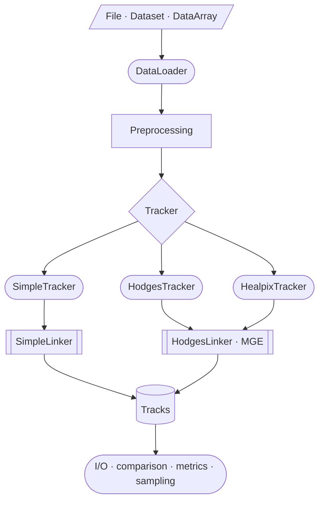
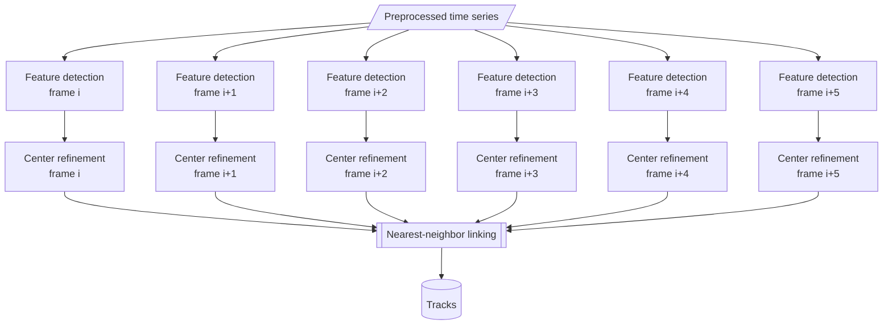
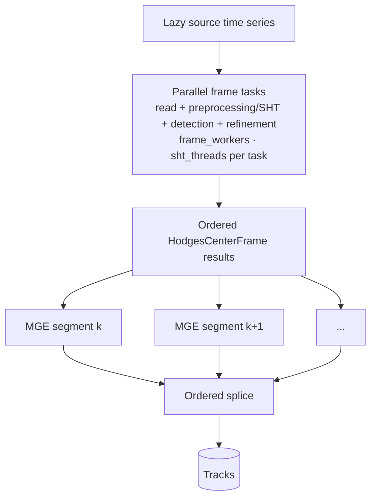
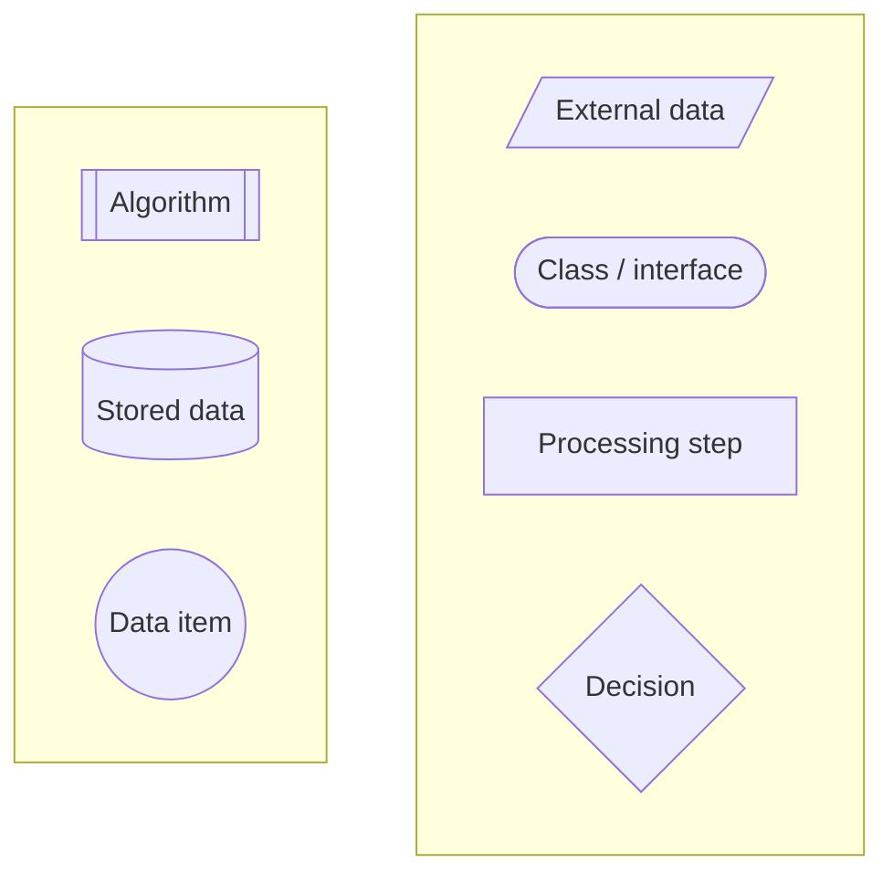

# PyStormTracker Architecture

This page describes the current runtime architecture of PyStormTracker, with a
focus on data flow, tracker composition, Dask execution, and the main
performance boundaries between stages. Scientific details and TRACK source
provenance for the Hodges method are documented in
[Hodges tracking and TRACK correspondence](hodges.md), HEALPix-specific behavior
in [HEALPix tracking](healpix.md), and serialization semantics in
[TrackJSON](trackjson.md).

## Runtime data flow

Input data are loaded and preprocessed before tracker-specific detection and
trajectory construction. All tracker implementations return `Tracks`.

## Module ownership

| Area                     | Primary ownership                                   | Responsibility                                                                     |
| ------------------------ | --------------------------------------------------- | ---------------------------------------------------------------------------------- |
| Tracker interface        | `models/tracker.py`                                 | `Tracker` protocol, `TrackingInput`, frame result type, backend exports            |
| Final trajectory model   | `models/tracks.py`                                  | immutable packed `Tracks`, lightweight `Track` views, metadata, internal builder   |
| Input/grid discovery     | `io/data_loader.py`                                 | file/xarray opening, coordinate aliases, grid metadata, global-longitude detection |
| Preprocessing            | `preprocessing/tracking.py`                         | taper, optional filter, projection/regridding, processing provenance               |
| Numerical preprocessing  | `preprocessing/`                                    | SHT/DCT filtering, kinematics, regridding, tapering                                |
| Feature refinement       | `refinement/`                                       | quadratic and B-spline refinement primitives                                       |
| Execution infrastructure | `backends.py`                                       | Dask worker resolution, owned thread pool, lazy frame blocks                       |
| Simple tracker           | `simple/`                                           | extrema detection, center refinement, nearest-neighbor trajectory linking          |
| Hodges tracker           | `hodges/`                                           | object detection, feature-point refinement, MGE, segmentation and splicing         |
| HEALPix tracker          | `healpix/`                                          | HEALPix topology and detection with Hodges MGE linking                             |
| Public operations        | `track.py`, `sample.py`, `compare.py`, `convert.py` | command/API orchestration around package components                                |
| Analysis                 | `metrics/`                                          | trajectory comparison and Eulerian/Lagrangian diagnostics                          |

## Tracks data model

`Tracks` is the common in-memory result for every tracker. Trajectory points are
stored in aligned one-dimensional arrays rather than as persistent Python
objects per point.

- `ids` identifies trajectories.
- `offsets` delimits each trajectory in the shared point columns.
- `times`, `lats`, `lons`, and variable columns store point data.
- Longitudes use `[-180, 180)` and times use the package millisecond time
  representation.
- Final arrays are C-contiguous and read-only.
- `Track` is a lightweight view over the parent arrays.
- `Center` objects are materialized only when point access requires them.

This representation is also the boundary used by TrackJSON, comparison, and
metric code.

## Input and preprocessing

`DataLoader` accepts file paths and xarray objects and resolves the dimensions
and coordinates required by the trackers. Tracker code therefore operates on a
normalized `xarray.DataArray` rather than maintaining separate NetCDF, GRIB,
or Zarr tracking implementations.

`preprocess_tracking_data()` handles:

1. optional `lmin`/`lmax` spectral filtering;
1. optional spatial boundary tapering;
1. SHT or DCT filtering when requested;
1. native-grid, polar-stereographic, or HEALPix geometry; and
1. `ProcessingStep` metadata for operations that actually occurred.

Optional filtering and transform bandwidth are distinct. Regridding may require
a finite transform bandwidth even when no scientific spectral filter was
requested.

For Dask execution, preprocessing remains in the xarray/Dask graph.
`extract_dask_frame_delayed_blocks()` produces one complete spatial block per
time step. Small coordinate and time arrays are materialized eagerly; the full
preprocessed time series is not converted to NumPy before frame tasks are
constructed.

## Dask execution

Dask parallelism is organized around independent source time steps. Detection
and refinement are sequential within one frame because refinement consumes the
detected candidates, while different frames can execute concurrently.

### SimpleTracker

Detection and center refinement are independent across time steps. The diagram
separates the two scientific stages, but each detection-refinement chain is one
frame-level Dask task. The resulting centers are ordered by time and passed to
one `SimpleLinker` operation.

Detection kernels are Numba-compiled and operate on two-dimensional NumPy
frames. `SimpleLinker` performs deterministic mutual-nearest matching between
active track tails and new centers. For each transition it constructs the
`n_active_tails x n_centers` great-circle-distance matrix, so linking cost grows
with the number of detected centers and remains the main serial boundary of the
Simple Dask path.

### HodgesTracker

Each frame task includes its lazy source read, any required preprocessing/SHT,
object and candidate detection, and feature-point refinement. Frame tasks are
independent across time steps and produce small immutable
`HodgesCenterFrame` objects. Each SHT call uses `sht_threads` DUCC0 native
threads per active task.

The detection objects are computed before MGE segment tasks are built. Overlap
lists reference the same detection objects; full filtered frame arrays are not
passed to MGE and the frame graph is released before segment linking. This
staged design keeps the filtered time series lazy through frame execution while
avoiding retention of the full-resolution fields just to support MGE.

Adjacent production segments overlap by two time steps and are spliced in
temporal order. The default scientific segment length is 62 frames.
`segment_frames` controls this MGE partition and is not a scheduler or I/O
chunk-size setting. MGE tasks can execute concurrently after their frame
dependencies complete; within one segment, Modified Greedy Exchange retains its
ordered pair-exchange algorithm. Its hot geometry, cost, and sweep kernels are
Numba-compiled and `nogil`, but one MGE segment is not internally divided into
parallel pair-exchange tasks.

When omitted, Dask `frame_workers` and `mge_workers` resolve independently to
available process CPU concurrency. `sht_threads=None` resolves to one DUCC0
thread per active transform for Dask and MPI, and to DUCC0's hardware-thread
default (`nthreads=0`) for serial execution. Explicit frame and MGE worker
controls apply only to Dask; explicit `sht_threads` is also meaningful for
serial and MPI rank-local transforms.

`HealpixTracker` follows the same frame-task and MGE-segment organization. Its
frame-level detection uses HEALPix pixel topology before passing refined feature
points to the same Hodges linking and segment-splice machinery.

### Dask critical paths

| Stage                    | SimpleTracker                        | HodgesTracker                                 | HealpixTracker                                |
| ------------------------ | ------------------------------------ | --------------------------------------------- | --------------------------------------------- |
| Preprocessing            | lazy xarray/Dask graph               | lazy xarray/Dask graph                        | lazy graph plus optional HEALPix regrid       |
| Detection and refinement | independent by frame                 | independent by frame                          | independent by frame                          |
| Frame result reuse       | one result consumed by global linker | one result reused by overlapping MGE segments | one result reused by overlapping MGE segments |
| Linking                  | one ordered `SimpleLinker` pass      | concurrent MGE segment tasks                  | concurrent MGE segment tasks                  |
| Final combination        | direct `Tracks` result               | ordered segment splice                        | ordered segment splice                        |

## SimpleTracker legacy comparison

The legacy column refers specifically to the `v0.0.2` Simple implementation.

| Aspect        | `v0.0.2` Simple                                                 | Current SimpleTracker                                                              |
| ------------- | --------------------------------------------------------------- | ---------------------------------------------------------------------------------- |
| Architecture  | script-level `RectGrid` and mutable `Tracks`                    | tracker class with package input, preprocessing, detection, and linking components |
| Parallel path | grid-partitioned process execution with mutable track reduction | Dask frame detection/refinement followed by one ordered global link                |
| Result model  | lists of `Center` objects serialized with pickle                | packed immutable `Tracks` with format-specific I/O outside the linker              |

The current implementation retains the local-extrema and nearest-neighbor
tracking concept, but not the legacy execution or storage architecture.

## Hodges MGE data architecture

`HodgesLinker` preserves the TRACK-compatible trajectory-state semantics needed
by MGE without making TRACK's transient object structures the public data
model. The linking representation uses contiguous feature arrays and an integer
assignment matrix whose cells contain feature indices or `-1` for phantom
entries.

The linking sequence is:

1. normalize per-frame detection results;
1. apply the TRACK-style feature-population prefilter;
1. flatten retained features and construct frame offsets;
1. initialize paired real/all-phantom MGE workspace rows;
1. run bounded forward/backward Modified Greedy Exchange;
1. split real sections around final phantom gaps; and
1. materialize real trajectories into packed `Tracks`.

HEALPix has its own object-detection topology but uses `HodgesLinker`, the same
segment planning, and the same segment-splice implementation.

## PyStormTracker Hodges vs TRACK 1.5.4

TRACK 1.5.4 is an implementation/parity reference for the supported Hodges
workflow. PyStormTracker reproduces selected TRACK source semantics inside a
different array-oriented execution architecture. Scientific behavior and
function-level TRACK provenance are documented in
[Hodges tracking and TRACK correspondence](hodges.md).

| Concern                   | TRACK 1.5.4                                               | PyStormTracker Hodges                                                                                   | Architecture/performance consequence                                                         |
| ------------------------- | --------------------------------------------------------- | ------------------------------------------------------------------------------------------------------- | -------------------------------------------------------------------------------------------- |
| Orchestration             | procedural C workflow with interactive/file-driven stages | `HodgesTracker` with package input and preprocessing components                                         | scientific stages are separated from execution policy                                        |
| Object segmentation       | hierarchical/quad-tree implementation                     | Numba iterative label propagation with TRACK-compatible connectivity semantics                          | contiguous array kernels replace source structure traversal                                  |
| Rectangular B-spline path | Dierckx SMOOPY surface and coordinate-space GDFP          | SciPy/FITPACK surface construction, extracted spline arrays, Numba evaluation and TRACK-compatible GDFP | established spline fitting is retained while repeated evaluation avoids Python callbacks     |
| MGE workspace             | real/phantom trajectory workspace                         | contiguous feature arrays and `int64` assignment matrix                                                 | source semantics are isolated from the public trajectory representation                      |
| MGE hot path              | ordered forward/backward exchange logic                   | source-shaped exchange logic in Numba `nogil` kernels                                                   | lower Python overhead; one segment retains the ordered pairwise dependency structure         |
| Parallel execution        | source workflow has no Dask task graph                    | frame-level Dask tasks plus MGE segment tasks                                                           | concurrency is added around independent frames and segments without changing MGE mathematics |
| Temporal partitioning     | source workflow and splice behavior                       | explicit 62-frame default segment plan with overlap-aware merge                                         | scientific partitioning remains separate from scheduler execution                            |
| Final data                | TRACK structures and text/reference output                | immutable packed `Tracks` plus serializers                                                              | one in-memory model serves TrackJSON, comparison, metrics, and sampling                      |
| Extensions                | TRACK source methods                                      | spherical quadratic and spherical B-spline/Riemannian alternatives                                      | extensions remain explicit and separate from the TRACK-compatible rectangular path           |

This table describes implementation architecture rather than universal speed.
Measured performance depends on grid size, feature population, preprocessing,
refinement method, segment count, and available CPU and memory bandwidth. See
[Benchmarking](benchmark.md) for benchmark methodology.

## CLI and library boundary

The CLI is an adapter over library components rather than a second tracking
implementation. `track` resolves tracker configuration and delegates to
`SimpleTracker`, `HodgesTracker`, or `HealpixTracker`; `sample`, `compare`, and
`convert` similarly call their library APIs. Package modules create ordinary
module loggers, while CLI configuration owns log presentation and interactive
progress.

## Diagram legend

Parallel execution is shown by independent graph branches; it does not use a
separate node type.

| Shape            | Meaning           |
| ---------------- | ----------------- |
| Parallelogram    | External data     |
| Stadium          | Class / interface |
| Rectangle        | Processing step   |
| Diamond          | Decision          |
| Double rectangle | Algorithm         |
| Cylinder         | Stored data       |
| Circle           | Data item         |
