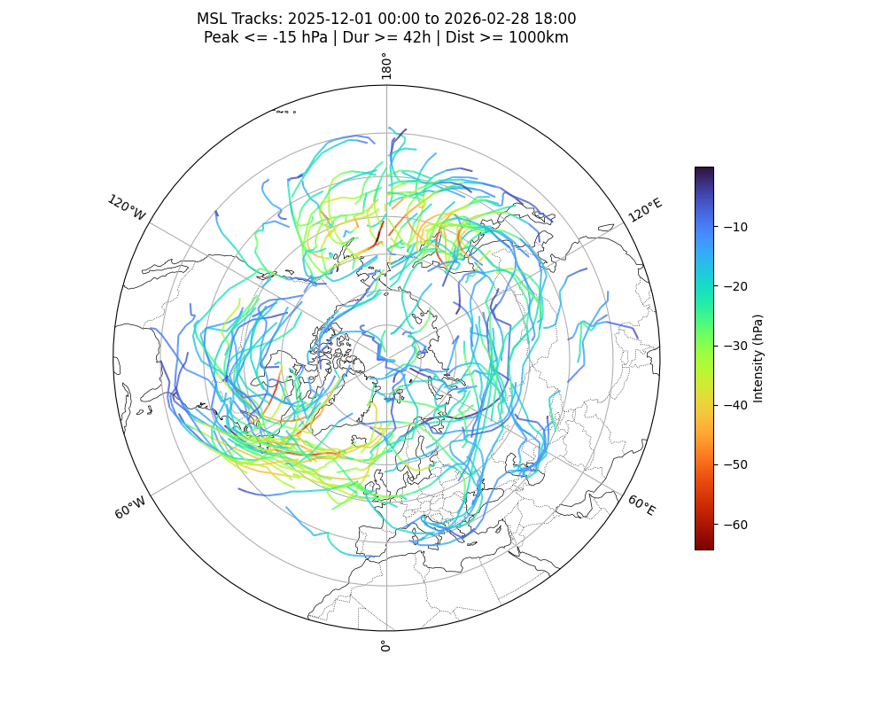

# PyStormTracker Hodges Implementation

  

This document details the architecture, mathematical implementation, and design rationale for the Hodges tracking algorithm in `PyStormTracker`. The primary goal is **algorithmic parity** with the TRACK software (Hodges 1994, 1995, 1999) while updating the interface and performance.

---

## 1. Feature Identification Design

### 1.1 Preprocessing (Spectral Filtering & Derivatives)
**Design Choice**: Integrated native spherical harmonic filtering (e.g., T42 truncation) and high-precision derivative calculation using the `shtns`, `ducc0`, or `shtools` backends.
- **References**: `spec_filt.c`, `uv2vr.c`.
- **CLI Options**: `--filter-range` (e.g., `5-42`), `--no-filter`, `--engine` (auto/shtns/ducc0/shtools), and `--taper`.

**Reasoning**: 
Original TRACK workflows typically require offline spectral filtering to remove the planetary background and high-frequency noise. `PyStormTracker` incorporates this directly into its preprocessing module for on-the-fly execution. By default, the Hodges algorithm applies a T5-42 band-pass filter unless `--no-filter` is specified. The system also supports high-precision **Relative Vorticity** and **Divergence** calculation from wind components using spin-1 vector harmonics, ensuring bit-wise parity with NCL/Spherepack when using the `ducc0` or `shtools` backends.

### 1.2 Object-Based Detection
**Design Choice**: Feature detection is implemented as a multi-stage pipeline: `Thresholding -> Connected Component Labeling (CCL) -> Object Filtering -> Local Extrema`.
- **References**: *Hodges 1994*, Section 2; `threshold.c` and `object_local_maxs.c`.

**Reasoning**: 
Original TRACK identifies "objects" (contiguous clusters of grid points exceeding a threshold) and then searches for extrema *only* within those objects. This prevents tracking isolated grid points that may represent noise.
- **Refinement**: The `min_points` parameter allows discarding small, insignificant features before identifying local extrema. (Ref: `object_filter.c`).

### 1.3 Connected Component Labeling (CCL)
**Design Choice**: Implemented `_numba_ccl` using **iterative label propagation** rather than TRACK's quad-tree approach.
- **References**: *Hodges 1994*, Section 3; `hierarc_segment.c`, `form_objects.c`.

**Parity Status**: **Identical**. Both methods produce identical object masks. The Numba version is more efficient on flat-memory architectures and avoids the pointer-based recursion of the original C code.

### 1.4 Sub-grid Refinement (Peak Finding)
**Design Choice**: Used 2D local quadratic surface fitting for sub-grid precision.
- **References**: *Hodges 1995*, Section 3; `surfit.c`, `gdfp_optimize.c`.

**Parity Status**: **Standard Equivalent**. While TRACK fits a global B-spline surface using a constrained conjugate gradient optimizer, quadratic fitting on a 3x3 neighborhood is the standard equivalent for identifying peaks between grid points. Coordinates may differ at the 2nd or 3rd decimal place, but track topology is rarely affected on high-resolution grids ($< 1.0^\circ$).

---

## 2. Trajectory Linking (MGE Optimization)

### 2.1 Spherical Cost Function ($\psi$)
**Mathematical Formula**:
$$\psi = 0.5 w_1 [1 - \mathbf{\hat{T}}_1 \cdot \mathbf{\hat{T}}_2] + w_2 \left[ 1 - \frac{2\sqrt{d_1 d_2}}{d_1 + d_2} \right]$$
- **References**: *Hodges 1999*, Section 3, Equation 6; `geod_dev.c`, `devn.c`.

**Reasoning**: 
The $0.5$ factor applied to the directional weight $w_1$ normalizes the term (range 0 to 2) to [0, 1], ensuring that if $w_1 + w_2 = 1$, the total cost $\psi$ is also bounded by 1.0.

### 2.2 Modified Greedy Exchange (MGE Optimization)
**Design Choice**: Implemented alternating forward/backward passes with **one best swap per frame**.
- **References**: *Hodges 1999*, Appendix; `fel_mge.c`, `mge_tracks.c`, `initialize_mge.c`.

**Parity Status**: **Identical**. This implementation fully replicates the recursive "one best swap per frame" logic. Convergence is guaranteed to match the original algorithm's local minimum.

### 2.3 Physical Constraints & Track Breaking
**Design Choice**: Integrated displacement checks directly into the MGE passes.
- **References**: *Hodges 1999*, Appendix; `track_fail.c`, `ub_disp.c`.

**Reasoning**: 
Original TRACK (`track_fail.c`) includes a mechanism to split trajectories if an exchange causes a point to exceed the maximum displacement ($d_{max}$). This implementation checks this after each swap, ensuring optimization never creates impossible physical links.

---

## 3. Adaptive Constraints

### 3.1 Regional $d_{max}$ (Zones)
**Implementation**: Passed via `zones` argument during tracker initialization.
- **References**: *Hodges 1999*, Section 5, Table 1; `read_zones.c`.

**Reasoning**: Storms move faster in the extratropics than the tropics. Applying a single $d_{max}$ globally either misses fast mid-latitude storms or creates noise in the tropics.

### 3.2 Speed-Dependent Smoothness (Adaptive $\psi_{max}$)
**Implementation**: Passed via `adapt_params` argument during tracker initialization.
- **References**: *Hodges 1999*, Section 5, Table 1; `read_adptp.c`.

**Reasoning**: As displacement (speed) increases, the directional constraint must become stricter. `PyStormTracker` uses piecewise linear interpolation between the 4 provided threshold/value pairs, matching the logic found in `read_adptp.c`.

---

## 4. Orchestration & Performance

### 4.1 Hybrid Parallelism (Gather-then-Link)
To ensure 100% bit-wise identity between serial and parallel runs, `PyStormTracker` parallelizes the computationally expensive **Detection** phase (>95% of runtime) but gathers results to a single process for the **Linking** (MGE) phase. This avoids the "track merging" complexities at process boundaries found in TRACK's `RSPLICE` utilities.

### 4.2 Matrix Representation & Phantom Points
Tracks are managed as a **2D integer matrix** (`n_tracks` x `n_frames`), where each cell stores the index of a feature or a **phantom point** (`-1`). This ensures the MGE matrix remains rectangular and allows trajectories to persist through missing frames up to the `max_missing` limit. (Ref: `mge_tracks.c`).

### 4.3 Computational Efficiency
- **Numba JIT**: All heavy mathematical loops (MGE, CCL, Geodesic math) are implemented as GIL-free, cache-enabled Numba kernels, matching or exceeding original C speeds.
- **Xarray Native**: Replaces legacy binary/ASCII I/O with coordinate-aware NetCDF/GRIB handling, facilitating integration with ERA5 and CMIP6.
- **HPC Ready**: A standard argparse-based CLI replaces interactive prompts, and the code supports **Serial**, **Dask**, and **MPI** backends with auto-detection.

---

## 5. Summary of Technical Differences

While `PyStormTracker` achieves parity in core tracking logic, the following table summarizes the technical implementation differences compared to the original TRACK C source:

| Component | TRACK (C Source) | PyStormTracker (Python/Numba) | Parity Impact |
| :--- | :--- | :--- | :--- |
| **Peak Finding** | Global B-spline + CG optimizer. | 2D local quadratic surface fit. | Minor (sub-grid precision). |
| **Segmentation** | Quad-tree data structure. | Iterative label propagation. | None (identical masks). |
| **Orchestration** | External shell-scripted utilities. | Native Python multiprocessing/MPI. | None (serial consistent). |
| **Tracking Logic** | Modified Greedy Exchange (MGE). | MGE (identical implementation). | **Full Parity**. |
| **Parallelism** | Domain/Time splitting (RSPLICE). | Parallel Detect + Gather-then-Link. | Improved (no splitting bugs). |
| **I/O Handling** | Custom binary and ASCII formats. | Xarray (NetCDF, GRIB, Zarr). | Improved (CF-compliant). |

---

## 6. References

The Hodges implementation in `PyStormTracker` is designed for algorithmic parity with the **TRACK-1.5.2** source code.

### Key Literature

- **Hodges, K. I.**, 1999: Adaptive Constraints for Feature Tracking. *Mon. Wea. Rev.*, **127**, 1362–1373, [https://doi.org/10.1175/1520-0493(1999)127<1362:ACFFT>2.0.CO;2](https://doi.org/10.1175/1520-0493(1999)127<1362:ACFFT>2.0.CO;2).

- **Hodges, K. I.**, 1995: Feature Tracking on the Unit Sphere. *Mon. Wea. Rev.*, **123**, 3458–3465, [https://doi.org/10.1175/1520-0493(1995)123<3458:FTOTUS>2.0.CO;2](https://doi.org/10.1175/1520-0493(1995)123<3458:FTOTUS>2.0.CO;2).

- **Hodges, K. I.**, 1994: A General Method for Tracking Analysis and Its Application to Meteorological Data. *Mon. Wea. Rev.*, **122**, 2573–2586, [https://doi.org/10.1175/1520-0493(1994)122<2573:AGMFTA>2.0.CO;2](https://doi.org/10.1175/1520-0493(1994)122<2573:AGMFTA>2.0.CO;2).
