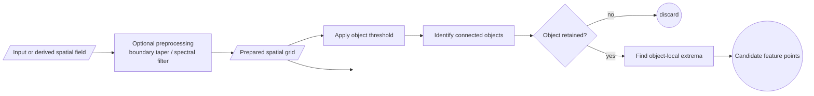
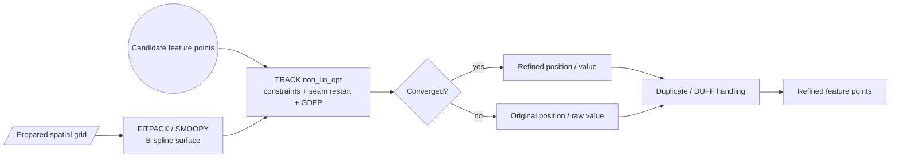
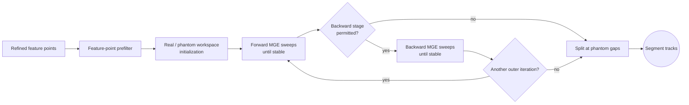

# TRACK Implementation and Comparison

PyStormTracker's `HodgesTracker` implements the feature-identification and
trajectory-linking method developed by Hodges (1994, 1995, 1999), with selected
implementation details reconciled against
[TRACK 1.5.4](https://gitlab.act.reading.ac.uk/track/track/-/tree/TRACK-1.5.4)
(tag `TRACK-1.5.4`, commit `6ded301a5f5183d73e5b49c16019024b9a53eff7`).

The papers are the scientific authority for the method. TRACK 1.5.4 is the
implementation reference for source-specific behavior that is not fully
specified in the papers. This page is also the canonical function-level TRACK
source reference for the supported workflow: source-dependent statements link
directly to the tagged TRACK 1.5.4 implementation and relevant line ranges.
Detailed source-stage reproduction, build instructions, probes, and validation
outputs belong in `PyStormTracker-Validation`.

## Scientific and implementation boundary

The implementation combines several layers that should not be conflated:

| Layer                                                                    | Authority                     | PyStormTracker relationship          |
| ------------------------------------------------------------------------ | ----------------------------- | ------------------------------------ |
| Feature identification and tracking method                               | Hodges (1994, 1995, 1999)     | Scientific lineage                   |
| Source-specific tracking semantics                                       | TRACK 1.5.4                   | Implementation/parity reference      |
| Rectangular and spherical B-spline construction                          | Dierckx/FITPACK through SciPy | Established numerical implementation |
| Spherical harmonics and HEALPix numerics                                 | `ducc0`                       | Numerical library                    |
| Spherical quadratic and intrinsic spherical B-spline optimization        | PyStormTracker                | Explicit extensions                  |
| Global one-to-one track assignment and exact timestamp-sequence identity | PyStormTracker                | Comparison/validation extensions     |

## Feature identification

### Spectral preparation and vorticity

TRACK's spatial spectral-filter workflow is implemented by
[`spectral_filter()`](https://gitlab.act.reading.ac.uk/track/track/-/blob/TRACK-1.5.4/src/spectral_filter.c#L32-220).
The interactive wrapper is
[`spec_filt()`](https://gitlab.act.reading.ac.uk/track/track/-/blob/TRACK-1.5.4/src/spec_filt.c),
while the Hoskins coefficient taper itself is implemented by
[`hoskins_filt()`](https://gitlab.act.reading.ac.uk/track/track/-/blob/TRACK-1.5.4/src/hoskins_filt.c#L4-20).

PyStormTracker uses `ducc0` for spherical-harmonic filtering. Filtering is
optional: both `lmin` and `lmax` must be supplied. `spectral_taper=1.0` retains
the requested band without an additional high-wavenumber coefficient taper.
Spatial boundary tapering through `taper_points` is a separate operation.

Global spherical-harmonic filtering is a **spatial -> spectral -> spatial**
operation: spherical-harmonic coefficients are an intermediate representation,
and feature identification operates on the synthesized spatial grid rather than
on spectral coefficients.

TRACK's wind-derived vorticity route is implemented by
[`compute_vorticity()`](https://gitlab.act.reading.ac.uk/track/track/-/blob/TRACK-1.5.4/src/compute_vorticity.c#L51-180).
PyStormTracker instead uses spin-1 vector spherical harmonics through `ducc0`;
this is related functionality rather than a claim of source-identical numerical
implementation.

### Thresholding, objects, and extrema

Hodges (1994) identifies coherent thresholded objects before selecting feature
points. The following diagram is the conceptual sequence; the implementation
path used to realize the object/candidate stages depends on the selected
refinement workflow as described below.


```mermaid
flowchart LR
    FIELD[/Input or derived spatial field/]
    FIELD --> PREP["Optional preprocessing<br/>boundary taper / spectral filter"]
    PREP --> GRID[/Prepared spatial grid/]

    GRID --> THRESH[Apply object threshold]
    GRID --> CONT[" "]

    THRESH --> OBJ[Identify connected objects]
    OBJ --> SIZE{Object retained?}
    SIZE -->|no| DROP((discard))
    SIZE -->|yes| EXT[Find object-local extrema]
    EXT --> CAND((Candidate feature points))

    classDef continuation fill:transparent,stroke:transparent,color:transparent;
    class CONT continuation;
```

TRACK's frame-level workflow is implemented by
[`threshold()`](https://gitlab.act.reading.ac.uk/track/track/-/blob/TRACK-1.5.4/src/threshold.c#L55-120).
Threshold membership is inclusive in
[`arrayd()`](https://gitlab.act.reading.ac.uk/track/track/-/blob/TRACK-1.5.4/src/arrayd.c#L12-46):
a normalized value equal to the threshold is retained. PyStormTracker therefore
uses `>=` for maxima and the sign-equivalent `<=` rule for minima.

TRACK segments the thresholded field with the hierarchical/quad-tree procedure
in
[`hierarc_segment()`](https://gitlab.act.reading.ac.uk/track/track/-/blob/TRACK-1.5.4/src/hierarc_segment.c#L20-140).
For the default global periodic `bspline` workflow, PyStormTracker uses a
TRACK-shaped rectangular candidate path that preserves the explicit cyclic
endpoint, seam-object merging, source candidate ordering, and adjacent-extrema
grouping before SMOOPY/GDFP refinement. Other supported workflows use
PyStormTracker's iterative label-propagation CCL while preserving the supported
TRACK connectivity semantics. Global longitude wraps; projected and regional
grids do not.

`min_object_grid_points` is the minimum retained object size. TRACK removes an
object when `point_num <= filt_pt_num` in
[`object_filter()`](https://gitlab.act.reading.ac.uk/track/track/-/blob/TRACK-1.5.4/src/object_filter.c#L13-95),
so `min_object_grid_points=N` corresponds to TRACK `filt_pt_num=N-1`.

TRACK's object-local feature-point search is implemented by
[`object_local_maxs()`](https://gitlab.act.reading.ac.uk/track/track/-/blob/TRACK-1.5.4/src/object_local_maxs.c#L29-230).
It uses a 3x3 object-local neighborhood. `exclude_boundary_extrema=True`
corresponds to the source `b_exc` behavior; TRACK modes with `tf >= 4` also
group adjacent tied extrema before later refinement. In PyStormTracker,
adjacent-extremum grouping is automatically part of the `bspline`,
`spherical_bspline`, and `quadratic` candidate workflows;
`group_adjacent_extrema=True` exposes optional grouping for the `grid`
refinement path.

### Off-grid feature-point refinement

Hodges (1995) extends feature-point location on the sphere using cubic
interpolation and local optimization. TRACK contains rectangular SMOOPY and
spherical SPHERY spline workflows. PyStormTracker's default
`feature_refinement="bspline"` follows the **rectangular SMOOPY** path used by
the reconciled TRACK workflow.

The diagram below shows the rectangular compatibility path. Periodic seam
restart and coordinate constraints are part of TRACK's `non_lin_opt()` wrapper
around GDFP rather than properties of GDFP itself.


```mermaid
flowchart LR
    GRID[/Prepared spatial grid/]
    CAND((Candidate feature points))

    GRID --> SPLINE["FITPACK / SMOOPY<br/>B-spline surface"]
    CAND --> OPT["TRACK non_lin_opt<br/>constraints + seam restart + GDFP"]
    SPLINE --> OPT

    OPT --> OK{Converged?}
    OK -->|yes| REF[Refined position / value]
    OK -->|no| ORIG[Original position / raw value]

    REF --> DUP[Duplicate / DUFF handling]
    ORIG --> DUP
    DUP --> OUT["Refined feature points"]
```

TRACK's relevant source path is:

1. [`spline_smooth()`](https://gitlab.act.reading.ac.uk/track/track/-/blob/TRACK-1.5.4/src/spline_smooth.c#L58-120)
   provides the interactive B-spline workflow;
1. [`surfit()`](https://gitlab.act.reading.ac.uk/track/track/-/blob/TRACK-1.5.4/src/surfit.c#L27-130)
   selects SMOOPY or SPHERY and obtains the smoothing factor;
1. [`smoopy_c()`](https://gitlab.act.reading.ac.uk/track/track/-/blob/TRACK-1.5.4/lib/src/smoopy_c.c#L47-125)
   wraps the rectangular Dierckx spline routine;
1. [`non_lin_opt()`](https://gitlab.act.reading.ac.uk/track/track/-/blob/TRACK-1.5.4/src/non_lin_opt.c#L320-500)
   prepares coordinate constraints, performs periodic seam restart, handles
   optimizer failure, and suppresses duplicate refined extrema;
1. [`gdfp_optimize()`](https://gitlab.act.reading.ac.uk/track/track/-/blob/TRACK-1.5.4/lib/src/gdfp_optimize.c#L39-260)
   performs constrained Goldfarb-Davidon-Fletcher-Powell optimization; and
1. [`update_h()`](https://gitlab.act.reading.ac.uk/track/track/-/blob/TRACK-1.5.4/lib/src/update_h.c#L8-90)
   updates the constraint/Hessian-like state used by that optimizer.

TRACK asks interactively for its B-spline smoothing factor and therefore has no
single non-interactive smoothing default. PyStormTracker uses
`bspline_smoothing=0.0` by default, corresponding to interpolation. SciPy's
FITPACK implementation constructs the spline; PyStormTracker extracts knots and
coefficients and performs repeated evaluation and optimization in NumPy/Numba.
The mathematical spline lineage is Dierckx/FITPACK; the numerical interface is
provided by SciPy.

`track_smoopy_optimization_scale` is a public numerical optimizer parameter. Its
normal default is `1.0`; the historical TRACK-compatible validation setting is
`0.01`. It does not rescale stored fields or detection thresholds. TRACK's line
search is not invariant to this numerical scaling.

The rectangular source-compatible path also preserves several non-obvious
`non_lin_opt()` semantics: a failed optimization retains the original grid
extremum and raw field value; periodic endpoint handling can trigger a seam
restart; and every rectangular candidate, including one whose optimization
failed, subsequently participates in source-order duplicate/DUFF handling.
These details are implementation compatibility, not new scientific criteria.

TRACK's spherical spline interface is exposed through
[`sphery_c()`](https://gitlab.act.reading.ac.uk/track/track/-/blob/TRACK-1.5.4/lib/src/sphery_c.c#L33-100).
PyStormTracker's `spherical_bspline` shares this Dierckx/FITPACK spline lineage,
but its optimizer is a PyStormTracker extension. It uses tangent-space
coordinates on $S^2$, intrinsic Riemannian gradients, numerical line searches
along great-circle geodesics, parallel transport of gradients and tangent
basis vectors, and a transported tangent-space DFP inverse-Hessian
approximation. The feasible region is fixed from the original detector
neighborhood so repeated iterations cannot migrate to another distant basin;
success requires an intrinsic stationarity criterion. Nonconvergence is
reported explicitly and does not silently fall back to another refinement
method.

`spherical_quadratic` is likewise a PyStormTracker candidate-local tangent-space
extension using spherical logarithm/exponential maps. `quadratic` and `grid`
remain explicit alternatives.

### Object diagnostics

PyStormTracker stores `raw_value`, `object_gridcell_area_km2`, and
`object_moment_*` diagnostics with final tracks. These are PyStormTracker
second-moment summaries, not equivalents of TRACK's optional object-shape
workflow. TRACK prepares that workflow in
[`boundary_find()`](https://gitlab.act.reading.ac.uk/track/track/-/blob/TRACK-1.5.4/src/boundary_find.c),
[`shape_setup()`](https://gitlab.act.reading.ac.uk/track/track/-/blob/TRACK-1.5.4/src/shape_setup.c),
and
[`anisotropy.c`](https://gitlab.act.reading.ac.uk/track/track/-/blob/TRACK-1.5.4/src/anisotropy.c).
No direct TRACK-equivalence claim is made for the current PyStormTracker
morphology variables.

## Trajectory linking

### Spherical local cost

For three consecutive real feature points, Hodges (1999, Eq. 6) combines
changes in tangent direction and displacement magnitude. In PyStormTracker's
notation,

```math
\psi =
0.5 w_1 \left(1 - \hat{\mathbf T}_1 \cdot \hat{\mathbf T}_2\right)
+ w_2 \left(1 - \frac{2\sqrt{d_1 d_2}}{d_1 + d_2}\right).
```

TRACK applies the directional `0.5` normalization when reading `w1` in
[`mge_tracks()`](https://gitlab.act.reading.ac.uk/track/track/-/blob/TRACK-1.5.4/src/mge_tracks.c#L190-260),
evaluates the spherical expression in
[`geod_dev()`](https://gitlab.act.reading.ac.uk/track/track/-/blob/TRACK-1.5.4/src/geod_dev.c#L18-95),
and dispatches real/phantom-point behavior through
[`devn()`](https://gitlab.act.reading.ac.uk/track/track/-/blob/TRACK-1.5.4/src/devn.c#L14-58).
The `0.5` factor normalizes the directional term, whose unscaled range is
0--2, so the directional contribution lies in 0--1 before weighting.

### Initialization and Modified Greedy Exchange

Before initialization, TRACK removes feature points that cannot connect within
the allowed displacement to the next frame, or to the previous frame if no
forward candidate qualifies. The displacement comparison is inclusive in
[`feature_pt_filter()`](https://gitlab.act.reading.ac.uk/track/track/-/blob/TRACK-1.5.4/src/feature_pt_filter.c#L17-120).

TRACK then creates a paired real/all-phantom workspace in
[`initialize_mge()`](https://gitlab.act.reading.ac.uk/track/track/-/blob/TRACK-1.5.4/src/initialize_mge.c#L17-230).
The nearest-candidate scan uses `dist <= distm`, so exact distance ties select
the later source-order candidate. PyStormTracker preserves this source-order
behavior because initialization can affect later equal-cost exchanges.

The following diagram shows the TRACK-shaped MGE algorithm within one temporal
segment. PyStormTracker's segment planning and splicing are execution
orchestration and are described separately below.


```mermaid
flowchart LR
    DET["Refined feature points"]
    DET --> PREF[Feature-point prefilter]
    PREF --> INIT["Real / phantom workspace<br/>initialization"]

    INIT --> FWD["Forward MGE sweeps<br/>until stable"]
    FWD --> BWD{"Backward stage<br/>permitted?"}

    BWD -->|yes| BACK["Backward MGE sweeps<br/>until stable"]
    BACK --> NEXT{Another outer iteration?}

    BWD -->|no| SPLIT[Split at phantom gaps]
    NEXT -->|yes| FWD
    NEXT -->|no| SPLIT

    SPLIT --> SEG((Segment tracks))
```

TRACK identifies the implementation as a modified greedy exchange algorithm,
with the Sethi-Jain method and Salari-Sethi occlusion modification named in
[`mge_tracks.c`](https://gitlab.act.reading.ac.uk/track/track/-/blob/TRACK-1.5.4/src/mge_tracks.c#L15-20).
The driver sets `tot_term=3`. Its outer loop
[`mge_tracks()`](https://gitlab.act.reading.ac.uk/track/track/-/blob/TRACK-1.5.4/src/mge_tracks.c#L590-650)
enters only for more than three frames. Within an active direction, complete
sweeps repeat until that direction makes no further exchange before control can
switch direction. A forward stage is permitted on each outer iteration, while
the backward stage is permitted only while `tot_count < tot_term`; the final
permitted outer iteration is therefore forward-only. PyStormTracker's
`mge_max_iterations=3` reproduces this algorithmic bound; it is not a generic
timeout.

When a four-knot adaptive table is active, each active direction first applies
the source-shaped phantom-gap and directional constraint handling before its
MGE sweep. The directional exchange stages themselves are implemented by
[`fel_mge()`](https://gitlab.act.reading.ac.uk/track/track/-/blob/TRACK-1.5.4/src/fel_mge.c#L25-220)
and
[`bel_mge()`](https://gitlab.act.reading.ac.uk/track/track/-/blob/TRACK-1.5.4/src/bel_mge.c#L25-220).

PyStormTracker applies this TRACK-shaped linking procedure independently within
overlapping temporal segments and then deterministically splices the resulting
segment tracks. This segmentation/splicing is PyStormTracker execution
architecture rather than part of the TRACK MGE algorithm shown above; see
[Architecture](architecture.md).

## Execution controls

Hodges Dask execution has three independent controls:

| Control         | Unit of concurrency                                                                          | Default when omitted              |
| --------------- | -------------------------------------------------------------------------------------------- | --------------------------------- |
| `frame_workers` | concurrent frame tasks, including lazy source read, preprocessing, detection, and refinement | available process CPU concurrency |
| `sht_threads`   | DUCC0 native threads per active spherical-harmonic transform                                 | one per active Dask/MPI transform |
| `mge_workers`   | concurrent independent MGE segment-linking tasks                                             | available process CPU concurrency |

`segment_frames=62` and the two-frame overlap remain scientific segmentation
parameters; they are independent of `mge_workers`. MGE is not internally
parallelized.

The resolution helpers in `pystormtracker.backends` own these defaults.
Serial and MPI execution do not use Dask frame or MGE worker pools, so explicit
`frame_workers` and `mge_workers` values are rejected there. Explicit
`sht_threads` remains meaningful for serial SHT and for rank-local MPI SHT.
The former Hodges `workers` parameter was removed in this development API;
SimpleTracker and HealpixTracker retain their generic `workers` controls.

The current SHT implementation uses DUCC0. PyStormTracker passes the resolved
`sht_threads` as DUCC0's `nthreads` argument to regular, reduced-grid, and
regridding transforms. DUCC0 0.41.0 also applies process-level native thread
limits from `DUCC0_NUM_THREADS` or, when absent, `OMP_NUM_THREADS`. For an
explicit request, PyStormTracker uses DUCC0's direct thread-pool resize API so
an inherited OMP limit does not silently cap the requested SHT pool; it does
not mutate those environment variables. Native environment values are logged
at DEBUG level with the resolved execution configuration.

### Physical constraints, failure, and finalization

Accepted exchanges are checked against displacement constraints. TRACK's
[`ub_disp()`](https://gitlab.act.reading.ac.uk/track/track/-/blob/TRACK-1.5.4/src/ub_disp.c)
provides the source upper-bound calculation. When a link fails, the directional
logic in
[`track_fail()`](https://gitlab.act.reading.ac.uk/track/track/-/blob/TRACK-1.5.4/src/track_fail.c#L12-140)
moves only the contiguous real section on the failing side into the first
compatible empty workspace interval. There is no separate generic bulk failure
cleanup after the bounded MGE loop.

After MGE, TRACK calls
[`track_split()`](https://gitlab.act.reading.ac.uk/track/track/-/blob/TRACK-1.5.4/src/track_split.c#L12-135)
to separate real sections divided by phantom gaps. PyStormTracker performs the
same logical finalization before packing real trajectories into `Tracks`.

### Missing input frames and phantom points

The following states are distinct:

- a **phantom entry** is an internal `feature_id=-1` assignment at an existing
  workspace time;
- an **all-phantom workspace row** is exchange workspace allocated alongside a
  real row;
- an existing input time can legitimately contain no detected feature; and
- a **known missing input frame** is a temporal jump between observed source
  frames, represented by temporal-gap metadata rather than by synthesizing an
  empty source frame.

TRACK records the number of known missing source frames on the preceding
observed frame. PyStormTracker derives that count from finalized source times
when `time_step` is known and never synthesizes the missing timestamps. For
`missing_frame_parameters`, row
`min(nmiss, n_rows - 1)` selects the TRACK-style `(dmax, phimax)` pair. Multiple
parameter rows therefore require a declared cadence; inferring cadence from the
shortest observed interval cannot distinguish missing frames when every
observed interval is already larger than the true source cadence.

The compact PyStormTracker zone and adaptive-table APIs describe one table.
TRACK's main MGE workflow can associate separate zone/adaptive tables with
missing-frame parameter rows; PyStormTracker does not silently reuse one table
for every row and rejects unsupported combinations. TRACK's separate legacy
post-link checker,
[`tr_miss_frame()`](https://gitlab.act.reading.ac.uk/track/track/-/blob/TRACK-1.5.4/src/tr_miss_frame.c),
is documented but not exposed as a separate public PyStormTracker workflow.

`max_missing_steps` is a separate PyStormTracker topology extension restricting
internal phantom runs during proposed exchanges. Leading and trailing phantoms
do not count toward it. The default `None` preserves TRACK MGE behavior with
respect to this extension.

## Adaptive constraints

Hodges (1999, Section 5) motivates spatially varying displacement limits and
speed-dependent smoothness.

TRACK reads regional limits with
[`read_zones()`](https://gitlab.act.reading.ac.uk/track/track/-/blob/TRACK-1.5.4/src/read_zones.c#L16-65).
With a nonempty zone table, every used real feature endpoint must lie in a
zone; there is no silent fallback. Nonnegative longitude definitions are
interpreted in the `0..360` convention, boundaries are inclusive, and the
per-link displacement limit is the average of the two endpoint-zone limits.
TRACK also resets its global displacement value to the maximum zone value;
PyStormTracker mirrors that behavior. An empty table selects the global `dmax`
path.

TRACK requires four displacement cutoffs and four corresponding `phimax` values
in
[`read_adptp()`](https://gitlab.act.reading.ac.uk/track/track/-/blob/TRACK-1.5.4/src/read_adptp.c#L17-115)
and precomputes three linear segments. The actual constraint is evaluated from
the mean of the two adjacent displacements by
[`phi()`](https://gitlab.act.reading.ac.uk/track/track/-/blob/TRACK-1.5.4/src/phi.c#L6-25).
PyStormTracker therefore accepts either a disabled table or four finite,
strictly increasing displacement knots. When active, static `phimax` is raised
to at least the maximum adaptive value. TRACK's directional zonal/adaptive
post-filter is implemented in
[`tr_zonal_filter()`](https://gitlab.act.reading.ac.uk/track/track/-/blob/TRACK-1.5.4/src/tr_zonal_filter.c).

## TRACK-style post-filtering

PyStormTracker's `filter_rsplice()` implements the supported lifetime and
displacement semantics of TRACK's post-tracking splice workflow. This is
post-processing and should not be conflated with MGE trajectory construction.

TRACK's workflow driver is
[`splice_tracks()`](https://gitlab.act.reading.ac.uk/track/track/-/blob/TRACK-1.5.4/src/splice.c#L40-220).
For displacement filtering,
[`disp_filter()`](https://gitlab.act.reading.ac.uk/track/track/-/blob/TRACK-1.5.4/src/disp_filter.c#L15-125)
can use cumulative travel distance or start-to-finish separation and removes a
track only when displacement is **strictly less than** the requested threshold.
A track exactly on the boundary is retained. TRACK's lower-level point-distance
helper is
[`measure()`](https://gitlab.act.reading.ac.uk/track/track/-/blob/TRACK-1.5.4/src/measure.c).

## Trajectory intercomparison

Trajectory intercomparison is **not part of the Hodges 1994/1995/1999 tracking
algorithm**. PyStormTracker uses TRACK's later ENSEMBLE utilities as the source
reference for its default eligibility rule.

TRACK 1.5.4 defines
[`TOLMATCH = 2.0` and `TOLNUM = 0.6`](https://gitlab.act.reading.ac.uk/track/track/-/blob/TRACK-1.5.4/utils/ENSEMBLE/compare_ensemble2.c#L9-12).
For each candidate pair, `compare_ensemble2.c` computes

$$
f\_{\\mathrm{overlap}} = \\frac{2N\_{\\mathrm{common}}}{N_1+N_2}
$$

and accepts the pair when the overlap fraction is at least `TOLNUM` and the
selected separation is no greater than `TOLMATCH`; see
[`compare_ensemble2.c`](https://gitlab.act.reading.ac.uk/track/track/-/blob/TRACK-1.5.4/utils/ENSEMBLE/compare_ensemble2.c#L620-665).
The source defaults are therefore **60% symmetric temporal overlap and 2 degrees
separation**. TRACK permits mean or minimum separation; PyStormTracker uses
whole-overlap **mean** geodesic separation.

[`toverlap()`](https://gitlab.act.reading.ac.uk/track/track/-/blob/TRACK-1.5.4/utils/ENSEMBLE/toverlap.c#L5-50)
finds the common interval, while
[`trdist()`](https://gitlab.act.reading.ac.uk/track/track/-/blob/TRACK-1.5.4/utils/ENSEMBLE/trdist.c#L12-145)
computes mean or minimum concurrent-point geodesic separation. TRACK then
selects the closest eligible candidate independently for each reference track,
so candidate reuse is possible.

The thresholds have published lineage but should not be attributed to the
original Hodges method papers. Hodges et al. (2003) used at least 60% temporal
overlap with a tighter 0.5-degree mean-separation condition. Wang, Swail, and
Zwiers (2006), comparing cyclone tracks on 2.5-degree unfiltered MSLP, retained
the 60% overlap criterion and used a 2.0-degree separation threshold. TRACK's
ENSEMBLE utility subsequently carries `0.6` and `2.0` as defaults.

PyStormTracker provides three pairing policies after applying eligibility:

- `nearest` follows TRACK's directed closest-eligible-candidate policy;
- `mutual_nearest` retains reciprocal nearest pairs, following the
  reciprocal-neighbor idea used by Blender and Schubert (2000), while retaining
  PyStormTracker's TRACK-style eligibility definition; and
- `global_assignment` is a PyStormTracker deterministic one-to-one extension
  that maximizes matched-pair count, then total temporal overlap, then minimizes
  total mean separation.

`topology_identical` is a **PyStormTracker validation diagnostic**, not a Hodges
or TRACK matching criterion. For an already matched pair it is true only when
the complete timestamp arrays are exactly equal. It has no geographic or
intensity tolerance. `same_time_range` and `same_point_count` are separate
reported diagnostics.

## Validation status

Source-stage probes reproduce selected TRACK detection, workspace, MGE,
constraint, failure, and splitting behavior directly. Those tests establish
implementation correspondence for the stated configurations; they do not make
TRACK independent scientific ground truth.

The strongest broad trajectory comparison currently available starts from
full-year 2024 six-hourly ERA5 MSLP on the F320 Gaussian source grid, retains
the TRACK T6--42 spectral band, reconstructs it onto the T42 Gaussian tracking
grid, and uses rectangular `bspline` refinement. Both implementations consume
the same TRACK-produced filtered spatial field, so this isolates the tracking
implementation and does **not** establish independent raw-ERA5
spectral-preprocessing identity.

| 2024 ERA5 MSLP, T6--42 on T42 grid |        Raw | RSPLICE-filtered |
| ---------------------------------- | ---------: | ---------------: |
| TRACK tracks                       |      7,761 |            1,471 |
| PyStormTracker tracks              |      7,859 |            1,470 |
| TRACK points                       |     60,654 |           30,998 |
| PyStormTracker points              |     60,883 |           31,015 |
| Global-assignment F1               | **0.9921** |       **0.9983** |
| Topology-identical matched pairs   |      7,708 |            1,453 |

Directed nearest matching covers 7,750 of 7,761 TRACK raw trajectories
(99.86%). After TRACK-compatible RSPLICE filtering, global one-to-one
assignment identifies 1,468 common storms among approximately 1,470 tracks,
with F1 0.9983. `topology_identical` means only that a matched pair has exactly
the same complete timestamp sequence; it does not require identical center
coordinates or intensities.

Detailed source-stage reproduction, discrepancy investigations, alternative
refinement experiments, polar workflows, and generated validation artifacts
belong in `PyStormTracker-Validation` rather than this method document.

## PyStormTracker extensions and known differences

| Area                                      | TRACK/Hodges relationship                  | PyStormTracker status                                                                       |
| ----------------------------------------- | ------------------------------------------ | ------------------------------------------------------------------------------------------- |
| Object identification                     | Hodges method; TRACK source correspondence | TRACK-shaped rectangular path for global `bspline`; iterative CCL for other supported paths |
| Rectangular B-spline centers              | TRACK SMOOPY + coordinate-space GDFP       | default `bspline` path                                                                      |
| Spherical quadratic                       | not TRACK                                  | explicit PyStormTracker extension                                                           |
| Intrinsic spherical B-spline optimization | not TRACK                                  | explicit PyStormTracker extension                                                           |
| MGE workspace and exchange control        | TRACK source correspondence                | source-shaped Python/Numba implementation                                                   |
| `max_missing_steps`                       | not TRACK MGE behavior                     | optional extension; disabled by default                                                     |
| Directed overlap/separation comparison    | TRACK ENSEMBLE utility lineage             | `nearest`                                                                                   |
| Reciprocal nearest comparison             | later intercomparison literature           | `mutual_nearest`                                                                            |
| Global one-to-one assignment              | not TRACK                                  | PyStormTracker extension                                                                    |
| Exact timestamp-sequence identity         | not TRACK                                  | PyStormTracker validation diagnostic                                                        |

## TRACK 1.5.4 source reference index

The narrative above links source where it affects scientific or software
behavior. This consolidated index replaces the former separate source-map page.
All links target the immutable `TRACK-1.5.4` tag.

| Stage                       | TRACK 1.5.4 source                                                                                                                                                                                                             | What it establishes                                      | PyStormTracker relationship                                                               |
| --------------------------- | ------------------------------------------------------------------------------------------------------------------------------------------------------------------------------------------------------------------------------ | -------------------------------------------------------- | ----------------------------------------------------------------------------------------- |
| Threshold workflow          | [`threshold()`](https://gitlab.act.reading.ac.uk/track/track/-/blob/TRACK-1.5.4/src/threshold.c#L55-120)                                                                                                                       | Frame-level threshold/object driver                      | Workflow reference                                                                        |
| Threshold membership        | [`arrayd()`](https://gitlab.act.reading.ac.uk/track/track/-/blob/TRACK-1.5.4/src/arrayd.c#L12-46)                                                                                                                              | Inclusive threshold test                                 | Matching max/min semantics                                                                |
| Object segmentation         | [`hierarc_segment()`](https://gitlab.act.reading.ac.uk/track/track/-/blob/TRACK-1.5.4/src/hierarc_segment.c#L20-140)                                                                                                           | Hierarchical object segmentation                         | Rectangular `bspline` path preserves TRACK-shaped representation; other paths use PST CCL |
| Object construction         | [`form_objects()`](https://gitlab.act.reading.ac.uk/track/track/-/blob/TRACK-1.5.4/src/form_objects.c)                                                                                                                         | Converts segmentation into object structures             | Source behavior reference                                                                 |
| Object-size filtering       | [`object_filter()`](https://gitlab.act.reading.ac.uk/track/track/-/blob/TRACK-1.5.4/src/object_filter.c#L13-95)                                                                                                                | `point_num <= filt_pt_num` removal                       | Maps to `min_object_grid_points`                                                          |
| Object-local extrema        | [`object_local_maxs()`](https://gitlab.act.reading.ac.uk/track/track/-/blob/TRACK-1.5.4/src/object_local_maxs.c#L29-230)                                                                                                       | 3x3 extrema, boundary option, grouping                   | Detector source reference                                                                 |
| Spectral filtering          | [`spectral_filter()`](https://gitlab.act.reading.ac.uk/track/track/-/blob/TRACK-1.5.4/src/spectral_filter.c#L32-220)                                                                                                           | Spatial spectral-filter workflow                         | `ducc0` implementation differs numerically                                                |
| Spectral wrapper            | [`spec_filt()`](https://gitlab.act.reading.ac.uk/track/track/-/blob/TRACK-1.5.4/src/spec_filt.c)                                                                                                                               | Interactive filtering orchestration                      | Not copied by PST                                                                         |
| Hoskins taper               | [`hoskins_filt()`](https://gitlab.act.reading.ac.uk/track/track/-/blob/TRACK-1.5.4/src/hoskins_filt.c#L4-20)                                                                                                                   | Exponential coefficient taper                            | Correct source owner                                                                      |
| Wind-derived vorticity      | [`compute_vorticity()`](https://gitlab.act.reading.ac.uk/track/track/-/blob/TRACK-1.5.4/src/compute_vorticity.c#L51-180)                                                                                                       | TRACK wind-to-vorticity workflow                         | PST uses spin-1 harmonics                                                                 |
| Spline dispatch             | [`surfit()`](https://gitlab.act.reading.ac.uk/track/track/-/blob/TRACK-1.5.4/src/surfit.c#L27-130)                                                                                                                             | SMOOPY/SPHERY selection and smoothing                    | Workflow reference                                                                        |
| Rectangular spline          | [`smoopy_c()`](https://gitlab.act.reading.ac.uk/track/track/-/blob/TRACK-1.5.4/lib/src/smoopy_c.c#L47-125)                                                                                                                     | Dierckx SMOOPY interface                                 | `bspline` compatibility lineage                                                           |
| Spherical spline            | [`sphery_c()`](https://gitlab.act.reading.ac.uk/track/track/-/blob/TRACK-1.5.4/lib/src/sphery_c.c#L33-100)                                                                                                                     | Dierckx SPHERY interface                                 | Spline lineage only for `spherical_bspline`                                               |
| Nonlinear refinement driver | [`non_lin_opt()`](https://gitlab.act.reading.ac.uk/track/track/-/blob/TRACK-1.5.4/src/non_lin_opt.c#L320-500)                                                                                                                  | Constraints, seam restart, failure, duplicate handling   | Rectangular compatibility behavior                                                        |
| GDFP optimizer              | [`gdfp_optimize()`](https://gitlab.act.reading.ac.uk/track/track/-/blob/TRACK-1.5.4/lib/src/gdfp_optimize.c#L39-260)                                                                                                           | Constrained variable-metric optimization                 | Native PST rectangular implementation                                                     |
| Constraint/Hessian update   | [`update_h()`](https://gitlab.act.reading.ac.uk/track/track/-/blob/TRACK-1.5.4/lib/src/update_h.c#L8-90)                                                                                                                       | Constraint-state update                                  | Source-mapped implementation detail                                                       |
| Spline objective support    | [`func.c`](https://gitlab.act.reading.ac.uk/track/track/-/blob/TRACK-1.5.4/lib/src/func.c)                                                                                                                                     | Objective/spline evaluation support                      | Source-mapped implementation detail                                                       |
| Feature-point prefilter     | [`feature_pt_filter()`](https://gitlab.act.reading.ac.uk/track/track/-/blob/TRACK-1.5.4/src/feature_pt_filter.c#L17-120)                                                                                                       | Inclusive adjacent-frame `dmax` eligibility              | Source-mapped                                                                             |
| MGE initialization          | [`initialize_mge()`](https://gitlab.act.reading.ac.uk/track/track/-/blob/TRACK-1.5.4/src/initialize_mge.c#L17-230)                                                                                                             | Greedy initialization and paired phantom rows            | Source-mapped workspace                                                                   |
| Spherical MGE cost          | [`geod_dev()`](https://gitlab.act.reading.ac.uk/track/track/-/blob/TRACK-1.5.4/src/geod_dev.c#L18-95), [`devn()`](https://gitlab.act.reading.ac.uk/track/track/-/blob/TRACK-1.5.4/src/devn.c#L14-58)                           | Real-point cost and phantom penalty                      | Source-mapped                                                                             |
| MGE scheduler               | [`mge_tracks()`](https://gitlab.act.reading.ac.uk/track/track/-/blob/TRACK-1.5.4/src/mge_tracks.c#L590-650)                                                                                                                    | Three-stage outer control and final split                | `mge_max_iterations=3` source                                                             |
| Forward/backward exchange   | [`fel_mge()`](https://gitlab.act.reading.ac.uk/track/track/-/blob/TRACK-1.5.4/src/fel_mge.c#L25-220), [`bel_mge()`](https://gitlab.act.reading.ac.uk/track/track/-/blob/TRACK-1.5.4/src/bel_mge.c#L25-220)                     | Directional MGE sweeps                                   | `hodges/mge.py` lineage                                                                   |
| Upper displacement bound    | [`ub_disp()`](https://gitlab.act.reading.ac.uk/track/track/-/blob/TRACK-1.5.4/src/ub_disp.c)                                                                                                                                   | Exchange displacement bound                              | Source-mapped                                                                             |
| Failure and final split     | [`track_fail()`](https://gitlab.act.reading.ac.uk/track/track/-/blob/TRACK-1.5.4/src/track_fail.c#L12-140), [`track_split()`](https://gitlab.act.reading.ac.uk/track/track/-/blob/TRACK-1.5.4/src/track_split.c#L12-135)       | Failure relocation and phantom-gap splitting             | Source-mapped                                                                             |
| Regional `dmax`             | [`read_zones()`](https://gitlab.act.reading.ac.uk/track/track/-/blob/TRACK-1.5.4/src/read_zones.c#L16-65)                                                                                                                      | Regional displacement table                              | `dmax_zones` lineage                                                                      |
| Adaptive smoothness         | [`read_adptp()`](https://gitlab.act.reading.ac.uk/track/track/-/blob/TRACK-1.5.4/src/read_adptp.c#L17-115), [`phi()`](https://gitlab.act.reading.ac.uk/track/track/-/blob/TRACK-1.5.4/src/phi.c#L6-25)                         | Four-knot piecewise-linear `phimax`                      | `adaptive_smoothness` lineage                                                             |
| Directional constraints     | [`tr_zonal_filter()`](https://gitlab.act.reading.ac.uk/track/track/-/blob/TRACK-1.5.4/src/tr_zonal_filter.c)                                                                                                                   | Directional zonal/adaptive filtering                     | Source reference                                                                          |
| Missing-frame checker       | [`tr_miss_frame()`](https://gitlab.act.reading.ac.uk/track/track/-/blob/TRACK-1.5.4/src/tr_miss_frame.c)                                                                                                                       | Legacy post-link missing-frame workflow                  | Documented, not exposed as separate API                                                   |
| RSPLICE workflow            | [`splice_tracks()`](https://gitlab.act.reading.ac.uk/track/track/-/blob/TRACK-1.5.4/src/splice.c#L40-220)                                                                                                                      | TRACK postprocessing driver                              | Workflow lineage                                                                          |
| RSPLICE displacement        | [`disp_filter()`](https://gitlab.act.reading.ac.uk/track/track/-/blob/TRACK-1.5.4/src/disp_filter.c#L15-125)                                                                                                                   | Travel/end-to-end displacement and strict removal test   | `filter_rsplice()` semantics                                                              |
| Distance helper             | [`measure()`](https://gitlab.act.reading.ac.uk/track/track/-/blob/TRACK-1.5.4/src/measure.c)                                                                                                                                   | Point separation helper                                  | Source helper                                                                             |
| Object boundary             | [`boundary_find()`](https://gitlab.act.reading.ac.uk/track/track/-/blob/TRACK-1.5.4/src/boundary_find.c)                                                                                                                       | Optional object-boundary representation                  | Not equivalent to PST moment diagnostics                                                  |
| Object shape setup          | [`shape_setup()`](https://gitlab.act.reading.ac.uk/track/track/-/blob/TRACK-1.5.4/src/shape_setup.c)                                                                                                                           | Optional shape workflow setup                            | Not equivalent to PST moment diagnostics                                                  |
| Anisotropy                  | [`anisotropy.c`](https://gitlab.act.reading.ac.uk/track/track/-/blob/TRACK-1.5.4/src/anisotropy.c)                                                                                                                             | TRACK anisotropy/shape workflow                          | Not implemented as direct equivalent                                                      |
| Comparison defaults         | [`compare_ensemble2.c`](https://gitlab.act.reading.ac.uk/track/track/-/blob/TRACK-1.5.4/utils/ENSEMBLE/compare_ensemble2.c#L9-12)                                                                                              | `TOLMATCH=2.0`, `TOLNUM=0.6`                             | Default pair eligibility                                                                  |
| Comparison eligibility      | [`compare_ensemble2.c`](https://gitlab.act.reading.ac.uk/track/track/-/blob/TRACK-1.5.4/utils/ENSEMBLE/compare_ensemble2.c#L620-665)                                                                                           | Overlap equation, thresholds, directed nearest selection | `nearest` lineage                                                                         |
| Overlap/separation helpers  | [`toverlap()`](https://gitlab.act.reading.ac.uk/track/track/-/blob/TRACK-1.5.4/utils/ENSEMBLE/toverlap.c#L5-50), [`trdist()`](https://gitlab.act.reading.ac.uk/track/track/-/blob/TRACK-1.5.4/utils/ENSEMBLE/trdist.c#L12-145) | Common interval and mean/minimum separation              | PST aligns exact common timestamps and uses mean separation                               |

## References

### Method papers

- **Hodges, K. I.**, 1994: A General Method for Tracking Analysis and Its
  Application to Meteorological Data. *Mon. Wea. Rev.*, **122**, 2573–2586.
  [doi:10.1175/1520-0493(1994)122\<2573:AGMFTA>2.0.CO;2](https://doi.org/10.1175/1520-0493%281994%29122%3C2573%3AAGMFTA%3E2.0.CO%3B2).
- **Hodges, K. I.**, 1995: Feature Tracking on the Unit Sphere.
  *Mon. Wea. Rev.*, **123**, 3458–3465.
  [doi:10.1175/1520-0493(1995)123\<3458:FTOTUS>2.0.CO;2](https://doi.org/10.1175/1520-0493%281995%29123%3C3458%3AFTOTUS%3E2.0.CO%3B2).
- **Hodges, K. I.**, 1999: Adaptive Constraints for Feature Tracking.
  *Mon. Wea. Rev.*, **127**, 1362–1373.
  [doi:10.1175/1520-0493(1999)127\<1362:ACFFT>2.0.CO;2](https://doi.org/10.1175/1520-0493%281999%29127%3C1362%3AACFFT%3E2.0.CO%3B2).

### Spline and spherical-optimization lineage

- **Dierckx, P.**, 1993: *Curve and Surface Fitting with Splines*. Oxford
  University Press.
- **Smith, S. T.**, 1994: Optimization Techniques on Riemannian Manifolds.
  *Fields Institute Communications*, **3**, 113–136.
- **Edelman, A., T. A. Arias, and S. T. Smith**, 1998: The Geometry of
  Algorithms with Orthogonality Constraints. *SIAM J. Matrix Anal. Appl.*,
  **20(2)**, 303–353.
  [doi:10.1137/S0895479895290954](https://doi.org/10.1137/S0895479895290954).
- **Huang, W., K. A. Gallivan, and P.-A. Absil**, 2015: A Broyden Class of
  Quasi-Newton Methods for Riemannian Optimization. *SIAM J. Optim.*,
  **25(3)**, 1660–1685.
  [doi:10.1137/140955483](https://doi.org/10.1137/140955483).

### Track intercomparison

- **Blender, R., and M. Schubert**, 2000: Cyclone Tracking in Different Spatial
  and Temporal Resolutions. *Mon. Wea. Rev.*, **128**, 377–384.
- **Hodges, K. I., B. J. Hoskins, J. Boyle, and C. Thorncroft**, 2003:
  A Comparison of Recent Reanalysis Datasets Using Objective Feature Tracking:
  Storm Tracks and Tropical Easterly Waves. *Mon. Wea. Rev.*, **131**,
  2012–2037.
  [doi:10.1175/1520-0493(2003)131\<2012:ACORRD>2.0.CO;2](https://doi.org/10.1175/1520-0493%282003%29131%3C2012%3AACORRD%3E2.0.CO%3B2).
- **Wang, X. L., V. R. Swail, and F. W. Zwiers**, 2006: Climatology and
  Changes of Extratropical Cyclone Activity: Comparison of ERA-40 with
  NCEP-NCAR Reanalysis for 1958-2001. *J. Climate*, **19**, 3145–3166.
  [doi:10.1175/JCLI3781.1](https://doi.org/10.1175/JCLI3781.1).
