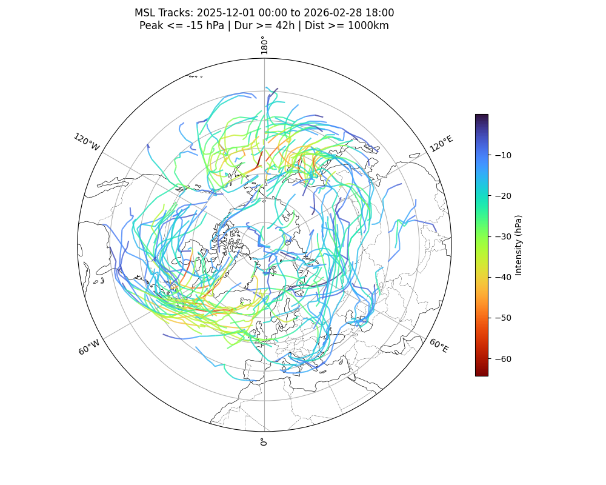

# PyStormTracker Hodges Implementation

  

This document describes the Hodges tracker and its relationship to TRACK (Hodges 1994, 1995, 1999). TRACK parity is a design target. The sections below distinguish implemented behavior from reference validation that remains.

---

## 1. Feature Identification Design

### 1.1 Preprocessing (Spectral Filtering & Derivatives)
**Implementation**: Spherical harmonic filtering and wind-derived vorticity/divergence use `ducc0`.
- **References**: `spec_filt.c`, `uv2vr.c`.
- **Accuracy**: See [Spectral Filtering Accuracy](spectral_accuracy.md) for detailed RMSE/Correlation metrics against NCL.

**Reasoning**: 
Original TRACK workflows commonly filter fields before tracking. PyStormTracker applies a T5-42 filter by default for Hodges tracking unless `--no-filter` is specified. The Python kinematics API computes relative vorticity and divergence from wind with spin-1 vector harmonics. Reference-data errors are reported in [Spectral Filtering Accuracy](spectral_accuracy.md).

### 1.2 Object-Based Detection
**Implementation**: Feature detection uses `Thresholding -> Connected Component Labeling (CCL) -> Object Filtering -> Local Extrema`.
- **References**: *Hodges 1994*, Section 2; `threshold.c` and `object_local_maxs.c`.

**Reasoning**: 
Original TRACK identifies objects as contiguous clusters of grid points that pass a threshold and searches for extrema within those objects, rather than treating every isolated threshold exceedance as a feature. The `min_points` parameter removes objects below a specified grid-point count before extrema extraction. (Ref: `object_filter.c`).

### 1.3 Connected Component Labeling (CCL)
**Implementation**: `_numba_ccl` uses iterative label propagation rather than TRACK's quad-tree approach.
- **References**: *Hodges 1994*, Section 3; `hierarc_segment.c`, `form_objects.c`.

**Validation Status**: Unit tests cover periodic and nonperiodic connectivity. Direct mask comparison with TRACK remains to be verified.

### 1.4 Sub-grid Refinement (Peak Finding)
**Implementation**: Center coordinates come from a local 2D quadratic fit. For periodic global grids, `RectSphereBivariateSpline` is fit once per frame and evaluated at the quadratic center.
- **References**: *Hodges 1995*, Section 3; `surfit.c`, `gdfp_optimize.c`, `spline_smooth.c`.

**Validation Status**: Quadratic refinement has unit coverage for geographic and projected grids. Direct optimization of the spherical B-spline center and comparison with TRACK remain to be implemented. The detector returns `raw_val`, `quad_val`, and `bspline_val`; the current Hodges linker retains only the primary tracked variable in the final `Tracks` object.

### 1.5 Object Properties & Size
**Implementation**: Object properties are calculated during detection.
- **References**: `boundary_find.c`, `shape_setup.c`.

`raw_size_km2` is calculated by summing grid-cell areas over the CCL-labeled object associated with each extremum. This provides the object-area quantity corresponding to TRACK's `ofill` processing. Intensity-weighted second spatial moments define an equivalent ellipse with `major_axis_km`, `minor_axis_km`, and `orientation_deg`. These fields are present in raw Hodges detections but are not propagated by the current linker to the final `Tracks` object. Tests cover global longitude seams and projected kilometre coordinates; direct property comparison with TRACK remains.

---

## 2. Trajectory Linking (MGE Optimization)

### 2.1 Spherical Cost Function ($\psi$)
**Mathematical Formula**:
$$\psi = 0.5 w_1 [1 - \mathbf{\hat{T}}_1 \cdot \mathbf{\hat{T}}_2] + w_2 \left[ 1 - \frac{2\sqrt{d_1 d_2}}{d_1 + d_2} \right]$$
- **References**: *Hodges 1999*, Section 3, Equation 6; `geod_dev.c`, `devn.c`.

**Reasoning**: 
The $0.5$ factor applied to the directional weight $w_1$ normalizes the term (range 0 to 2) to [0, 1], ensuring that if $w_1 + w_2 = 1$, the total cost $\psi$ is also bounded by 1.0.

### 2.2 Modified Greedy Exchange (MGE Optimization)
**Implementation**: Linking uses alternating forward and backward passes with one selected swap per frame.
- **References**: *Hodges 1999*, Appendix; `fel_mge.c`, `mge_tracks.c`, `initialize_mge.c`.

**Validation Status**: Unit tests cover linking, constraints, breaking, and missing points. End-to-end numerical comparison with TRACK remains to be verified.

### 2.3 Physical Constraints & Track Breaking
**Implementation**: Displacement checks run during MGE passes.
- **References**: *Hodges 1999*, Appendix; `track_fail.c`, `ub_disp.c`.

**Reasoning**: 
Original TRACK (`track_fail.c`) includes a mechanism to split trajectories if an exchange causes a point to exceed the maximum displacement ($d_{max}$). This implementation checks displacement after each swap and breaks links that exceed the configured constraint.

---

## 3. Adaptive Constraints

### 3.1 Regional $d_{max}$ (Zones)
**Implementation**: Passed via `zones` argument during tracker initialization.
- **References**: *Hodges 1999*, Section 5, Table 1; `read_zones.c`.

**Reasoning**: Storms move faster in the extratropics than the tropics. Applying a single $d_{max}$ globally either misses fast mid-latitude storms or creates noise in the tropics.

### 3.2 Speed-Dependent Smoothness (Adaptive $\psi_{max}$)
**Implementation**: Passed via `adapt_params` argument during tracker initialization.
- **References**: *Hodges 1999*, Section 5, Table 1; `read_adptp.c`.

**Reasoning**: As displacement (speed) increases, the directional constraint must become stricter. `PyStormTracker` uses piecewise linear interpolation between the 4 provided threshold/value pairs, matching the logic found in `read_adptp.c`.

---

## 4. Orchestration & Performance

### 4.1 Serial Chunking (Gather-then-Link)
Hodges detection can be divided into time chunks, but the raw detections are gathered before one **Linking** (MGE) pass. Chunk boundaries therefore do not alter the result, and this avoids the track-merging behavior of TRACK's `RSPLICE` utilities. Hodges currently executes these chunks serially; Dask and MPI backends are not yet implemented for this tracker.

### 4.2 Matrix Representation & Phantom Points
Tracks are managed as a **2D integer matrix** (`n_tracks` x `n_frames`), where each cell stores the index of a feature or a **phantom point** (`-1`). This ensures the MGE matrix remains rectangular and allows trajectories to persist through missing frames up to the `max_missing` limit. (Ref: `mge_tracks.c`).

### 4.3 Computational Efficiency
- **Numba JIT**: MGE, CCL, object-property, subgrid-refinement, and great-circle kernels are cache-enabled and compiled with `nogil=True`.
- **Coordinate-aware Xarray input**: `DataLoader` provides NetCDF, GRIB, and Zarr input and identifies geographic, projected, Gaussian, reduced-Gaussian, and HEALPix coordinates.
- **Execution**: A standard argparse-based CLI replaces interactive prompts. Hodges tracking currently uses the serial backend; unsupported parallel selections fail explicitly.

---

## 5. Summary of Technical Differences

The following table records known implementation differences from TRACK:

| Component | TRACK (C Source) | PyStormTracker (Python/Numba) | Parity Impact |
| :--- | :--- | :--- | :--- |
| **Peak finding** | Global spherical B-spline surface plus conjugate-gradient optimizer. | Local quadratic stationary point; `RectSphereBivariateSpline` value evaluated at that point. | Center optimization differs and requires reference validation. |
| **Segmentation** | Hierarchical quad-tree data structure. | Numba iterative label propagation on a grid-neighbor graph. | Method differs; reference masks remain to be compared. |
| **Orchestration** | External shell utilities and RSPLICE. | Serial chunked detection followed by one linking pass. | Chunked and unchunked PyStormTracker results are tested equal. |
| **Tracking logic** | Modified Greedy Exchange. | Python/Numba MGE implementation. | Component tests exist; TRACK output comparison remains. |
| **Parallelism** | Domain/time splitting. | Hodges parallel backends not implemented. | Serial only. |
| **I/O** | TRACK binary and ASCII formats. | Xarray input; IMILAST, tdump, and JSON track output. | Format behavior differs. |

---

## 6. References

The Hodges implementation in `PyStormTracker` is designed for algorithmic parity with the **TRACK-1.5.2** source code.

### Key Literature

- **Hodges, K. I.**, 1999: Adaptive Constraints for Feature Tracking. *Mon. Wea. Rev.*, **127**, 1362–1373, [doi:10.1175/1520-0493(1999)127<1362:ACFFT>2.0.CO;2](https://doi.org/10.1175/1520-0493%281999%29127%3C1362%3AACFFT%3E2.0.CO%3B2).

- **Hodges, K. I.**, 1995: Feature Tracking on the Unit Sphere. *Mon. Wea. Rev.*, **123**, 3458–3465, [doi:10.1175/1520-0493(1995)123<3458:FTOTUS>2.0.CO;2](https://doi.org/10.1175/1520-0493%281995%29123%3C3458%3AFTOTUS%3E2.0.CO%3B2).

- **Hodges, K. I.**, 1994: A General Method for Tracking Analysis and Its Application to Meteorological Data. *Mon. Wea. Rev.*, **122**, 2573–2586, [doi:10.1175/1520-0493(1994)122<2573:AGMFTA>2.0.CO;2](https://doi.org/10.1175/1520-0493%281994%29122%3C2573%3AAGMFTA%3E2.0.CO%3B2).
